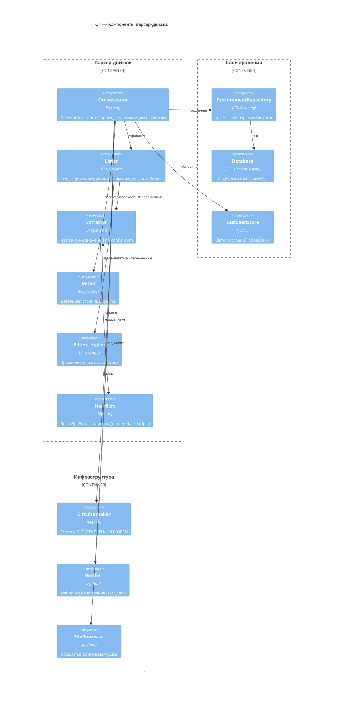

# C4 — Component (Уровень 3)

Компонентная диаграмма парсер-движка.

## Комментарии
- `handlers` — чистые функции, покрыты unit-тестами.
- `repo` гарантирует отсутствие повторной записи заявки с тем же номером
  (unique-констрейнт + проверка перед вставкой).
- `stop_conditions` обрабатываются в `orchestrator` перед сохранением/уведомлением.
