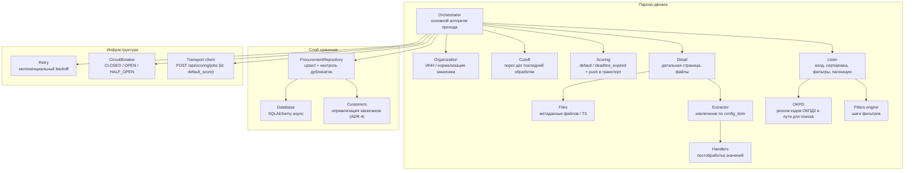

# C4 — Component (Уровень 3)

Компонентная диаграмма парсер-движка.

## Комментарии
- **Handlers** — чистые функции, покрыты unit-тестами.
- **ProcurementRepository** гарантирует отсутствие повторной записи заявки с тем же
  номером (unique-констрейнт + проверка перед вставкой); **Customers** — нормализация
  заказчиков и поиск ИНН (ADR-4).
- **stop_conditions** обрабатываются в **Orchestrator** перед сохранением.
- **Обработка файлов** (PDF/DOCX/ZIP, поиск ТЗ) вынесена во **внешний сервис** (ADR-5):
  парсер хранит метаданные, результат внешний сервис возвращает через API.
- **Scoring**: при сохранении проставляется дефолтный score (`default`) или
  `deadline_expired` для просроченных; затем **Transport client** автоматически отправляет
  задание в транспорт скоринга (`POST /api/scoring/jobs` с приоритетом = дефолтным score).
  Финальный внешний score возвращается в парсер через `POST /score` (ADR-7).
- **Уведомления** подписчиков отправляются **не в движке**, а в FastAPI-слое —
  в обработчике `POST /api/procurements/{id}/score` после обновления score, если
  `score ≥ notify_min_score` (порог из конфига).
