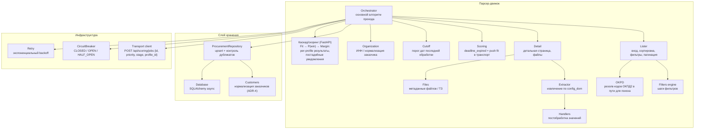

# C4 — Component (Уровень 3)

Компонентная диаграмма парсер-движка.

## Комментарии
- **Handlers** — чистые функции, покрыты unit-тестами.
- **ProcurementRepository** гарантирует отсутствие повторной записи закупки с тем же
  номером (unique-констрейнт + проверка перед вставкой); **Customers** — нормализация
  заказчиков и поиск ИНН (ADR-4).
- **stop_conditions** обрабатываются в **Orchestrator** перед сохранением.
- **Обработка файлов** (PDF/DOCX/ZIP, поиск ТЗ) вынесена во **внешний сервис** (ADR-5):
  парсер хранит метаданные, результат внешний сервис возвращает через API.
- **Scoring**: закупка сохраняется **без оценки** (дефолтный скор удалён, миграция 1.34);
  для просроченных выставляется `deadline_expired`. **Transport client** автоматически
  отправляет задание в транспорт скоринга (`POST /api/scoring/jobs` со `stage="fit"`,
  приоритет = время обновления/публикации, `profile_id` — пер-профильно, BR-07).
- **Каскад/скоринг** (в FastAPI-слое): результат стадии в `POST /score` пишется профилю
  из `body.profile_id` (BR-07); множители (`fit_score`/`p_win`/`margin`) сохраняются в
  `procurement_evaluations`, `score` — накопленное произведение. Автокаскад
  Fit → P(win) → Margin отключён: P(win)/Margin запускаются по явному запросу тендеролога
  (`POST /api/procurements/pwin-margin`, флаги `pwin_enabled`/`margin_enabled`); пороги
  `pwin_fit_threshold`/`margin_pwin_threshold` удалены (ADR-10). Дополнительно
  `analysis_service` выполняет on-demand RAG-анализ ТЗ (стоп-условия, маркеры).
- **Уведомления** подписчиков отправляются **не в движке**, а в FastAPI-слое —
  в обработчике `POST /api/procurements/{id}/score` **после каждой стадии** каскада
  (fit/pwin/margin), когда значение стадии прошло её порог
  (`notify_min_fit_score`/`notify_min_pwin`/`notify_min_margin` из `config_ops.yaml`).
