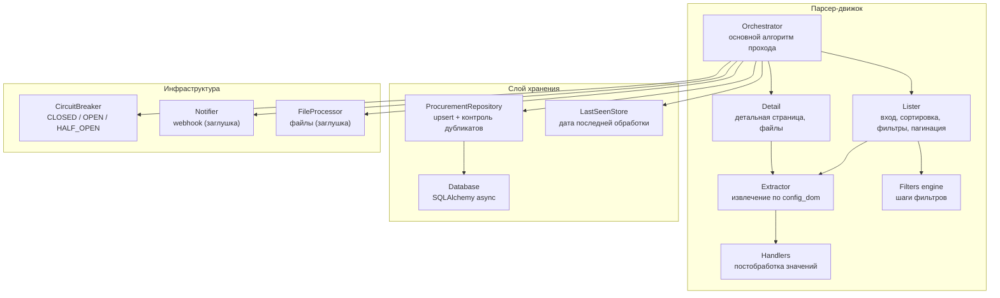

# C4 — Component (Уровень 3)

Компонентная диаграмма парсер-движка.

## Комментарии
- **Handlers** — чистые функции, покрыты unit-тестами.
- **ProcurementRepository** гарантирует отсутствие повторной записи заявки с тем же
  номером (unique-констрейнт + проверка перед вставкой).
- **stop_conditions** обрабатываются в **Orchestrator** перед сохранением/уведомлением.
