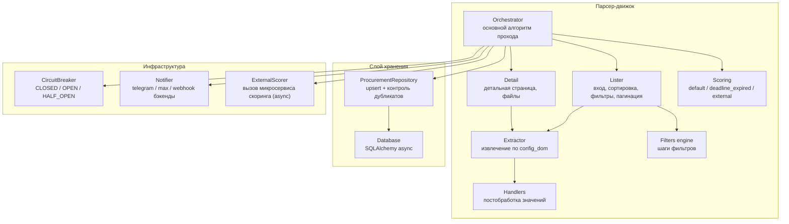

# C4 — Component (Уровень 3)

Компонентная диаграмма парсер-движка.

## Комментарии
- **Handlers** — чистые функции, покрыты unit-тестами.
- **ProcurementRepository** гарантирует отсутствие повторной записи заявки с тем же
  номером (unique-констрейнт + проверка перед вставкой).
- **stop_conditions** обрабатываются в **Orchestrator** перед сохранением/уведомлением.
- **Обработка файлов** (PDF/DOCX/ZIP, поиск ТЗ) вынесена во **внешний сервис** (ADR-5):
  парсер хранит метаданные, результат внешний сервис возвращает через API.
- **ExternalScorer** вызывает микросервис скоринга после сохранения «сырой» записи;
  подписчики уведомляются только после обновления score (ADR-3/ADR-6).
