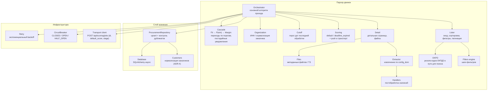

# C4 — Component (Уровень 3)

Компонентная диаграмма парсер-движка.

## Комментарии
- **Handlers** — чистые функции, покрыты unit-тестами.
- **ProcurementRepository** гарантирует отсутствие повторной записи закупки с тем же
  номером (unique-констрейнт + проверка перед вставкой); **Customers** — нормализация
  заказчиков и поиск ИНН (ADR-4).
- **stop_conditions** обрабатываются в **Orchestrator** перед сохранением.
- **Обработка файлов** (PDF/DOCX/ZIP, поиск ТЗ) вынесена во **внешний сервис** (ADR-5):
  парсер хранит метаданные, результат внешний сервис возвращает через API.
- **Scoring**: при сохранении проставляется дефолтный score и `fit_score`
  (`default`, fit-множитель по ОКПД2) или `deadline_expired` для просроченных; затем
  **Transport client** автоматически отправляет задание в транспорт скоринга
  (`POST /api/scoring/jobs` с приоритетом = дефолтным score и `stage="fit"`).
- **Cascade** (в FastAPI-слое): после возврата результата стадии в `POST /score`
  переход к следующей стадии (Fit → P(win) → Margin) выполняется по порогам
  `pwin_fit_threshold`/`margin_pwin_threshold` (`config_score.yaml`), если стадия
  включена (`pwin_enabled`/`margin_enabled`); стадия сохраняет свой множитель
  (`fit_score`/`p_win`/`margin`), `score` — накопленное произведение (ADR-7/ADR-9).
- **Уведомления** подписчиков отправляются **не в движке**, а в FastAPI-слое —
  в обработчике `POST /api/procurements/{id}/score` **после каждой стадии** каскада
  (fit/pwin/margin), когда значение стадии прошло её порог
  (`notify_min_fit_score`/`notify_min_pwin`/`notify_min_margin` из `config_ops.yaml`).
