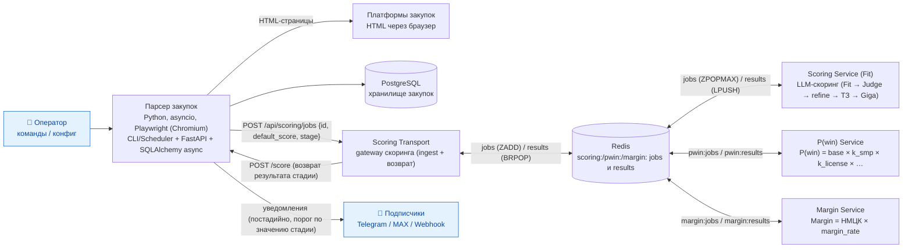

# C4 — Container (Уровень 2)

Диаграмма контейнеров системы парсера.

## Замечания
- **Акторы** (оператор, подписчики) помечены символом «человечка» 👤 и выделены
  голубой заливкой. Mermaid `flowchart` не рисует стикменов, поэтому люди обозначены
  значком 👤 (в строгом C4 акторы — стикмены).
- **Парсер закупок** — единый контейнер (CLI/Scheduler, FastAPI, парсер-движок
  Playwright, слой хранения SQLAlchemy async, Notifier). Пишет в PostgreSQL с контролем
  дубликатов по `number + platform_id`. Парсер не скачивает файлы — в БД хранятся
  только метаданные файлов (имя и URL скачивания с ЭТП).
- **Скоринг** — каскад **Fit → P(win) → Margin** (ADR-7/ADR-9): после сохранения закупки
  парсер автоматически передаёт задание в **Scoring Transport** (`POST /api/scoring/jobs`
  с приоритетом = дефолтным score и стадией `stage`), транспорт ставит его в **Redis**
  очередь стадии, сервис стадии обрабатывает задание и возвращает результат через
  транспорт (`POST /score`). Переходы между стадиями оркестрирует парсер по порогам
  (`pwin_fit_threshold`/`margin_pwin_threshold`, флаги `pwin_enabled`/`margin_enabled`).
  Транспорт — единственная граница между конвейером и парсером; приоритет приходит из
  парсера (эвристика дефолтного score в транспорте не дублируется).
- **LLM-пайплайн** `scoring_service`: Fit → Judge → refine (`num_refine_rounds`) →
  уточнение по тексту ТЗ (`tz_review`) → параллельная ветка векторной близости
  **Giga Embedder** (влияет на score через `giga_embedding_alpha`, результат —
  `embedding_similarity`). Режим заглушки `score_use_stub` выключен.
- **Уведомления** подписчиков отправляются **после каждой стадии** каскада (fit/pwin/
  margin), когда значение стадии прошло её порог (`notify_min_fit_score`/
  `notify_min_pwin`/`notify_min_margin`; флаги `notify_{fit,pwin,margin}_enabled`
  в `config_ops.yaml`).
