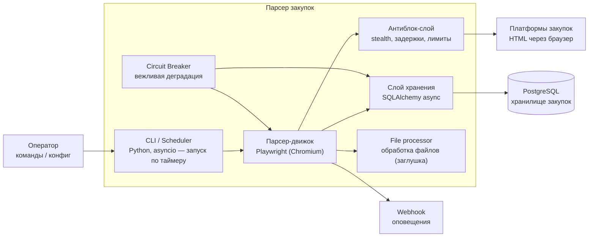

# C4 — Container (Уровень 2)

Диаграмма контейнеров системы парсера.

## Замечания
- **Слой хранения** пишет в PostgreSQL через SQLAlchemy 2.x (async) с контролем
  дубликатов по `number + source_platform`.
- **Антиблок-слой** включает stealth-скрипты, задержки, лимиты и персистентную сессию.
