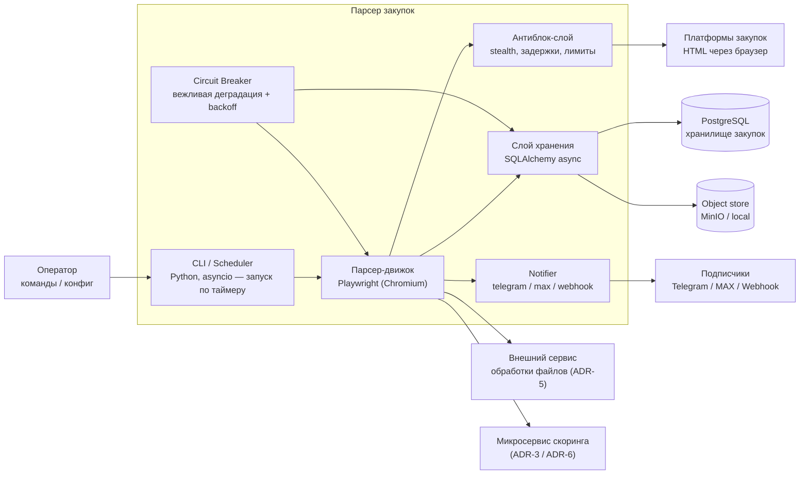

# C4 — Container (Уровень 2)

Диаграмма контейнеров системы парсера.

## Замечания
- **Слой хранения** пишет в PostgreSQL через SQLAlchemy 2.x (async) с контролем
  дубликатов по `number + source_platform`; скачанные файлы — в объектное
  хранилище (MinIO/local, `storage.object_store`), в БД — ссылка, а не бинарник.
- **Обработка файлов** (PDF/DOCX/ZIP, поиск ТЗ) вынесена во **внешний сервис** (ADR-5);
  парсер хранит метаданные файлов, результат внешний сервис возвращает через
  `POST /api/procurements/{id}/technical-spec`.
- **Скоринг** выполняется микросервисом асинхронно (ADR-3/ADR-6); оповещение
  подписчиков происходит только после обновления score в БД.
- **Антиблок-слой** включает stealth-скрипты, задержки, лимиты и персистентную сессию;
  ретраи с экспоненциальным backoff (`retry.py`) перед открытием circuit breaker.
