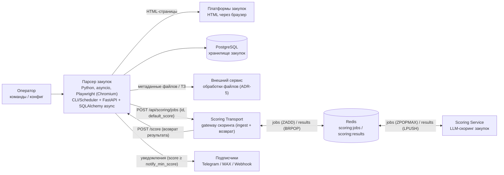

# C4 — Container (Уровень 2)

Диаграмма контейнеров системы парсера.

## Замечания
- **Парсер закупок** — единый контейнер (CLI/Scheduler, FastAPI, парсер-движок
  Playwright, слой хранения SQLAlchemy async, Notifier). Пишет в PostgreSQL с контролем
  дубликатов по `number + source_platform`. Парсер не скачивает файлы — в БД хранятся
  только метаданные файлов (имя и URL скачивания с ЭТП).
- **Обработка файлов** (PDF/DOCX/ZIP, поиск ТЗ) вынесена во **внешний сервис** (ADR-5);
  парсер хранит метаданные файлов, результат внешний сервис возвращает через
  `POST /api/procurements/{id}/technical-spec`.
- **Скоринг** выполняется асинхронным конвейером (ADR-7): после сохранения закупки
  парсер автоматически передаёт задание в **Scoring Transport** (`POST /api/scoring/jobs`
  с приоритетом = дефолтным score), транспорт ставит его в **Redis** по приоритету,
  **Scoring Service** обрабатывает задание и возвращает результат через транспорт
  (`POST /score`). Транспорт — единственная граница между конвейером и парсером;
  приоритет приходит из парсера (эвристика дефолтного score в транспорте не дублируется).
- **Уведомления** подписчиков отправляются только после обновления финального score,
  если `score ≥ notify_min_score` (порог из конфига).
