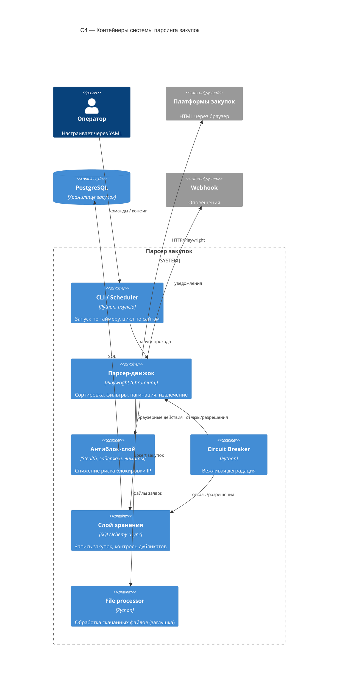

# C4 — Container (Уровень 2)

Диаграмма контейнеров системы парсера.

## Замечания
- `store` пишет в PostgreSQL, используя SQLAlchemy 2.x (async) и контроль дубликатов
  по `number + source_platform`.
- `antibot` включает stealth-скрипты, задержки, лимиты и персистентную сессию.
