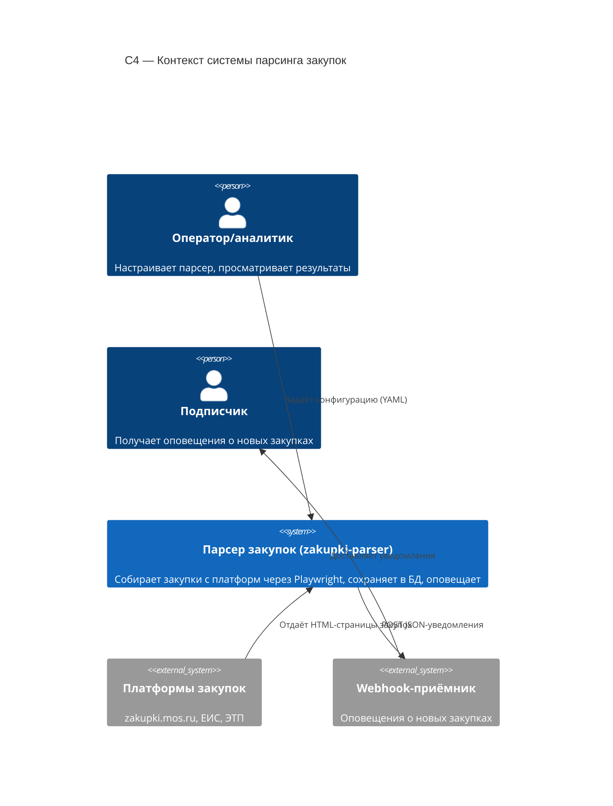

# C4 — Context (Уровень 1)

Контекстная диаграмма системы парсера площадок закупок.

## Легенда
- **Окружение**: оператор и подписчики — внешние роли.
- **Внешние системы**: платформы закупок (источник данных) и webhook-приёмник.
- **Внутренняя система**: `zakupki-parser`.
