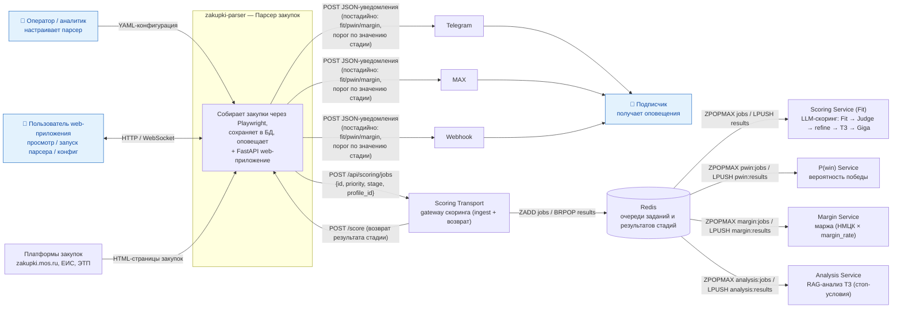

# C4 — Context (Уровень 1)

Контекстная диаграмма системы парсера площадок закупок.

## Легенда
- **Оператор/аналитик**, **подписчик** и **пользователь web-приложения** — внешние роли
  (акторы; помечены символом 👤 и голубой заливкой — Mermaid `flowchart` не рисует
  «человечков»).
- **Платформы закупок**, **Scoring Transport**, **Redis**, **Scoring Service (Fit)**,
  **P(win) Service**, **Margin Service**, **Analysis Service** и каналы
  **Telegram / MAX / Webhook** — внешние системы.
- **zakupki-parser** — внутренняя система: парсинг закупок (Playwright), сохранение
  в БД, уведомления и **FastAPI web-приложение** (просмотр закупок/заказчиков/профилей,
  запуск парсера, редактирование конфигурации; набор вкладок — по ролям).
- **Скоринг** — каскад **Fit → P(win) → Margin** (ADR-7/ADR-9): парсер после сохранения
  автоматически передаёт задание в транспорт, тот ставит его в Redis-очередь стадии
  (`scoring:jobs` со `stage="fit"`, приоритет = время обновления/публикации).
  `scoring_service` считает **Fit** по LLM-пайплайну (Fit → Judge → refine → ТЗ →
  Giga-эмбеддинги). **Автокаскад отключён**: P(win) (`pwin_service`) и Margin
  (`margin_service`) запускаются по явному запросу тендеролога (`POST /api/procurements/pwin-margin`,
  флаги `pwin_enabled`/`margin_enabled`). **Analysis Service** выполняет on-demand
  RAG-анализ ТЗ (стоп-условия, маркеры). Результат каждой стадии возвращается через
  транспорт; уведомление подписчиков — **после каждой стадии** (fit/pwin/margin),
  если значение стадии прошло её порог.
