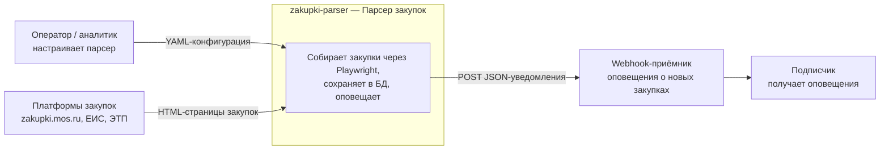

# C4 — Context (Уровень 1)

Контекстная диаграмма системы парсера площадок закупок.

## Легенда
- **Оператор/аналитик** и **подписчик** — внешние роли.
- **Платформы закупок** и **webhook-приёмник** — внешние системы.
- **zakupki-parser** — внутренняя система.
