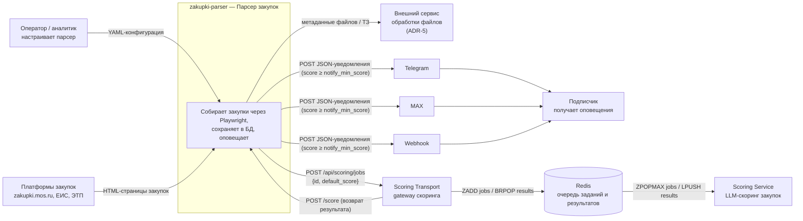

# C4 — Context (Уровень 1)

Контекстная диаграмма системы парсера площадок закупок.

## Легенда
- **Оператор/аналитик** и **подписчик** — внешние роли.
- **Платформы закупок**, **внешний сервис обработки файлов**, **Scoring Transport**,
  **Redis**, **Scoring Service** и каналы **Telegram / MAX / Webhook** — внешние системы.
- **zakupki-parser** — внутренняя система. Парсер не скачивает файлы: только метаданные
  (имя/URL) в БД; глубокая обработка файлов — внешним сервисом (ADR-5).
- **Скоринг** выполняется конвейером `Scoring Transport` → `Redis` → `Scoring Service`
  (ADR-7): парсер после сохранения автоматически передаёт задание в транспорт, а
  уведомление подписчиков отправляется только после возврата финального скора, если
  `score ≥ notify_min_score`.
