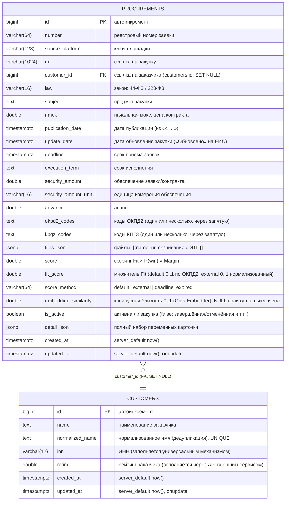

# Схема базы данных

Схема БД парсера (PostgreSQL). Миграции — Liquibase (`../../docker/liquibase/changelog`),
ORM-модель — `../../src/zakupki_parser/storage/db.py`.



## Замечания
- **Две таблицы**: `procurements` и справочник `customers` (ADR-4). Заказчик
  нормализован: вместо денормализованной колонки `customer` — FK `customer_id`
  (при удалении заказчика — `SET NULL`).
- **Справочник заказчиков** `customers`: `name`, `normalized_name` (ключ дедупликации,
  UNIQUE `uq_customers_normalized_name`), `inn`, `rating` (заполняется через API
  внешним сервисом).
- Дата последней обработанной записи **не хранится** в state-файле: порог берётся
  из БД (`MAX(update_date)` по площадке), а при отсутствии записей — из
  `default_cutoff_days` в `config_service.yaml`.
- **Защита от дубликатов**: уникальный констрейнт `uq_procurement_number_platform`
  на `(number, source_platform)`.
- **Индексы**: `ix_procurements_created_at` по `created_at`,
  `ix_procurements_customer_id` по `customer_id`.
- `score_method`: `default | external | deadline_expired` (значение `calculating`
  удалено вместе с воркером внешнего скоринга, ADR-7).
- `fit_score` (миграция 1.15): множитель Fit — дефолтный (0..1 из `fit_table` по ОКПД2)
  или нормализованный внешний (0..1). `embedding_similarity` (миграция 1.16) —
  косинусная близость ветки Giga Embedder. `is_active` (миграция 1.14) — активна ли
  закупка; выставляется парсером по текстовому `status` из `detail_json`.
- `detail_json` хранит весь набор извлечённых переменных карточки для аналитики.

## Ключевые SQL-запросы
- Проверка дубликата перед вставкой:
  ```sql
  SELECT id FROM procurements
  WHERE number = $1 AND source_platform = $2;
  ```
- Дата последней обработанной записи по площадке (порог):
  ```sql
  SELECT MAX(update_date) FROM procurements WHERE source_platform = $1;
  ```
- Одинарная/множественная вставка исключает повтор:
  ```sql
  INSERT INTO procurements (...) VALUES (...)
  ON CONFLICT (number, source_platform) DO NOTHING;
  ```
