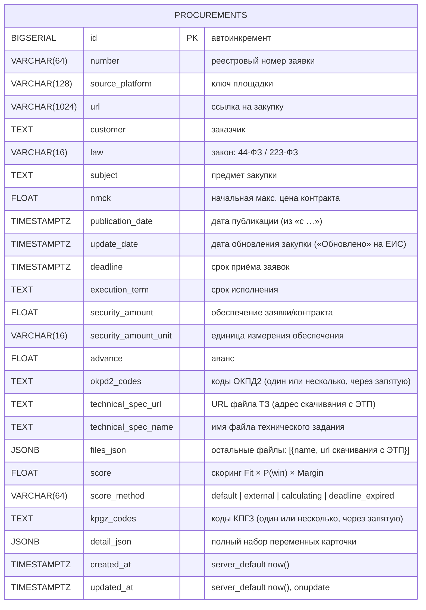

# Схема базы данных

Схема БД парсера (PostgreSQL). Миграции — Liquibase (`../../docker/liquibase/changelog`),
ORM-модель — `../../src/zakupki_parser/storage/db.py`.



## Замечания
- **Таблица одна** — `procurements`. Дата последней обработанной записи **не хранится**
  в state-файле: порог берётся из БД (`MAX(update_date)` по площадке), а при отсутствии
  записей — из `default_cutoff_days` в `config_service.yaml`.
- **Защита от дубликатов**: уникальный констрейнт `uq_procurement_number_platform`
  на `(number, source_platform)`.
- **Индекс** `ix_procurements_created_at` по `created_at`.
- `detail_json` хранит весь набор извлечённых переменных карточки для аналитики.
- Справочник заказчиков (`customers`, рейтинг) — **будущая работа** по ADR-4
  (нормализация при разработке скорингового сервиса), ещё не реализована.

## Ключевые SQL-запросы
- Проверка дубликата перед вставкой:
  ```sql
  SELECT id FROM procurements
  WHERE number = $1 AND source_platform = $2;
  ```
- Дата последней обработанной записи по площадке (порог):
  ```sql
  SELECT MAX(update_date) FROM procurements WHERE source_platform = $1;
  ```
- Одинарная/множественная вставка исключает повтор:
  ```sql
  INSERT INTO procurements (...) VALUES (...)
  ON CONFLICT (number, source_platform) DO NOTHING;
  ```
