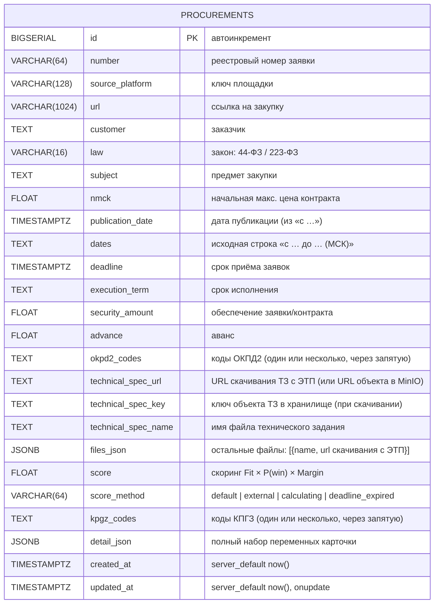

# Схема базы данных

Схема БД парсера (PostgreSQL). Миграции — Liquibase (`../../docker/liquibase/changelog`),
ORM-модель — `../../src/zakupki_parser/storage/db.py`.



## Замечания
- **Таблица одна** — `procurements`. Отдельной таблицы дат последней обработки нет
  (она получается SQL-запросом; текущий порог — в `data/last_seen.json`).
- **Защита от дубликатов**: уникальный констрейнт `uq_procurement_number_platform`
  на `(number, source_platform)`.
- **Индекс** `ix_procurements_created_at` по `created_at`.
- `detail_json` хранит весь набор извлечённых переменных карточки для аналитики.

## Ключевые SQL-запросы
- Проверка дубликата перед вставкой:
  ```sql
  SELECT id FROM procurements
  WHERE number = $1 AND source_platform = $2;
  ```
- Дата последней обработанной записи по площадке:
  ```sql
  SELECT MAX(updated_at) FROM procurements WHERE source_platform = $1;
  ```
- Одинарная/множественная вставка исключает повтор:
  ```sql
  INSERT INTO procurements (...) VALUES (...)
  ON CONFLICT (number, source_platform) DO NOTHING;
  ```
