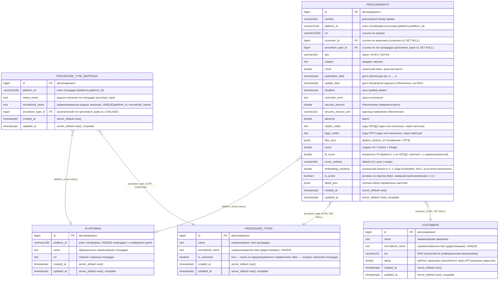

# Схема базы данных

Схема БД парсера (PostgreSQL). Миграции — Liquibase (`../../docker/liquibase/changelog`),
ORM-модель — `../../src/zakupki_parser/storage/db.py`.



## Замечания
- **Пять таблиц**: `procurements`, справочники `customers` (ADR-4),
  `procedure_types`, `procedure_type_mappings` и `platforms`. Заказчик нормализован:
  вместо денормализованной колонки `customer` — FK `customer_id` (при удалении
  заказчика — `SET NULL`). Тип процедуры (`purchase_type` из карточки списка)
  нормализован в `procedure_types` (миграция 1.20).
- **Платформы** (миграция 1.21): справочник `platforms` (натуральный ключ
  `platform_id`, официальное имя, главная страница; сид из `configs/dom/*.yaml`).
  Колонка `procurements.source_platform` переименована в `platform_id` — единое
  именование ключа платформы во всех таблицах и конфигах. FK на `procurements`
  намеренно нет: ключ стабильный, набор платформ задаётся конфигом; join по ключу
  (официальное имя/URL отдаются через API как `platform_name`/`platform_url`).
- **Типы процедур — гибрид «предзагруженный справочник + fallback»**:
  - `procedure_types` — канонический справочник (способы 44-ФЗ/223-ФЗ, засеян из
    дропдауна «Тип процедуры» fabrikant и способов ЕИС) + «сырые» значения площадок
    без маппинга (`is_canonical=false`);
  - `procedure_type_mappings` — предзагруженное соответствие
    «площадка + родное значение (native_name) -> канонический тип» (например
    «Электронный запрос котировок» roseltorg -> «Запрос котировок»);
  - резолв при сохранении закупки: маппинг -> тип по имени -> find-or-create
    (новый тип логируется: «нужен маппинг»).
- **Справочник заказчиков** `customers`: `name`, `normalized_name` (ключ дедупликации,
  UNIQUE `uq_customers_normalized_name`), `inn`, `rating` (заполняется через API
  внешним сервисом).
- Дата последней обработанной записи **не хранится** в state-файле: порог берётся
  из БД (`MAX(update_date)` по площадке), а при отсутствии записей — из
  `default_cutoff_days` в `config_service.yaml`.
- **Защита от дубликатов**: уникальный констрейнт `uq_procurement_number_platform`
  на `(number, platform_id)`.
- **Индексы**: `ix_procurements_created_at` по `created_at`,
  `ix_procurements_customer_id` по `customer_id`,
  `ix_procurements_procedure_type_id` по `procedure_type_id`,
  `ix_procedure_type_mappings_platform` по `platform_id`,
  `ix_platforms_platform_id` по `platform_id`.
- `score_method`: `default | fit | pwin | margin` (каскад Fit → P(win) → Margin, ADR-7).
- `fit_score` (миграция 1.15): множитель Fit — дефолтный (0..1 из `fit_table` по ОКПД2)
  или нормализованный внешний (0..1). `embedding_similarity` (миграция 1.16) —
  косинусная близость ветки Giga Embedder. `is_active` (миграция 1.14) — активна ли
  закупка по статусу; выставляется парсером по текстовому `status` из `detail_json`
  (`list_config.active_statuses`). Текущая дата (срок актуальности `deadline`) при
  записи не учитывается — она применяется на стороне клиента (фильтр `active`
  в `list_procurements`, эффективная активность в API-ответах).
- `detail_json` хранит весь набор извлечённых переменных карточки для аналитики.

## Ключевые SQL-запросы
- Проверка дубликата перед вставкой:
  ```sql
  SELECT id FROM procurements
  WHERE number = $1 AND platform_id = $2;
  ```
- Дата последней обработанной записи по площадке (порог):
  ```sql
  SELECT MAX(update_date) FROM procurements WHERE platform_id = $1;
  ```
- Одинарная/множественная вставка исключает повтор:
  ```sql
  INSERT INTO procurements (...) VALUES (...)
  ON CONFLICT (number, platform_id) DO NOTHING;
  ```
