# Схема базы данных

Схема БД парсера (PostgreSQL). Миграции — Liquibase (`../../docker/liquibase/changelog`),
ORM-модель — `../../src/zakupki_parser/storage/db/`.

```mermaid
erDiagram
    CUSTOMERS {
        bigint id PK "автоинкремент"
        text name "наименование заказчика"
        text normalized_name "нормализованное имя (дедупликация), UNIQUE"
        varchar(12) inn "ИНН (заполняется универсальным механизмом)"
        double rating "рейтинг заказчика (заполняется через API внешним сервисом)"
        timestamptz created_at "server_default now()"
        timestamptz updated_at "server_default now(), onupdate"
    }

    PLATFORMS {
        bigint id PK "автоинкремент"
        varchar(128) platform_id "ключ платформы, UNIQUE (совпадает с configs/dom/<platform_id>.yaml)"
        text name "официальное наименование площадки"
        text url "главная страница площадки"
        timestamptz created_at "server_default now()"
        timestamptz updated_at "server_default now(), onupdate"
    }

    PROCEDURE_TYPES {
        bigint id PK "автоинкремент"
        text name "наименование типа процедуры"
        text normalized_name "нормализованное имя (дедупликация), UNIQUE"
        boolean is_canonical "true — канон из предзагруженного справочника; false — «сырое» значение площадки"
        timestamptz created_at "server_default now()"
        timestamptz updated_at "server_default now(), onupdate"
    }

    PROCEDURE_TYPE_MAPPINGS {
        bigint id PK "автоинкремент"
        varchar(128) platform_id "ключ площадки (platforms.platform_id)"
        text native_name "родное значение на площадке (purchase_type)"
        text normalized_name "нормализованное родное значение, UNIQUE(platform_id, normalized_name)"
        bigint procedure_type_id FK "канонический тип (procedure_types.id, CASCADE)"
        timestamptz created_at "server_default now()"
        timestamptz updated_at "server_default now(), onupdate"
    }

    PROCUREMENTS {
        bigint id PK "автоинкремент"
        varchar(64) number "реестровый номер закупки"
        varchar(128) platform_id "ключ платформы-источника (platforms.platform_id)"
        varchar(1024) url "ссылка на закупку"
        bigint customer_id FK "ссылка на заказчика (customers.id, SET NULL)"
        bigint procedure_type_id FK "ссылка на тип процедуры (procedure_types.id, SET NULL)"
        varchar(16) law "закон: 44-ФЗ / 223-ФЗ"
        text subject "предмет закупки"
        double nmck "начальная макс. цена контракта"
        timestamptz publication_date "дата публикации (из «с …»)"
        timestamptz update_date "дата обновления закупки («Обновлено» на ЕИС)"
        timestamptz deadline "срок приёма заявок"
        text execution_term "срок исполнения"
        double security_amount "обеспечение заявки/контракта"
        varchar(16) security_amount_unit "единица измерения обеспечения"
        double advance "аванс"
        text okpd2_codes "коды ОКПД2 (один или несколько, через запятую)"
        text kpgz_codes "коды КПГЗ (один или несколько, через запятую)"
        jsonb files_json "файлы: [{name, url скачивания с ЭТП}]"
        boolean is_active "активна ли закупка (false: завершённая/отменённая и т.п.)"
        jsonb detail_json "полный набор переменных карточки"
        timestamptz created_at "server_default now()"
        timestamptz updated_at "server_default now(), onupdate"
    }

    USERS {
        bigint id PK "автоинкремент"
        varchar(128) username "логин, UNIQUE"
        varchar(255) email "email (nullable)"
        text password_hash "PBKDF2-хэш пароля"
        jsonb roles "роли: [user, admin, analyst, devops]"
        varchar(16) status "active | blocked"
        timestamptz created_at "server_default now()"
        timestamptz updated_at "server_default now(), onupdate"
    }

    PROFILES {
        bigint id PK "автоинкремент"
        bigint user_id FK "владелец профиля (users.id, CASCADE)"
        text name "имя профиля"
        boolean enabled "профиль участвует в обработке"
        boolean is_active "единственный активный профиль пользователя"
        double min_fit_threshold "порог Fit"
        jsonb target_etp "целевые ЭТП"
        jsonb target_laws "целевые законы"
        jsonb okpd_codes "коды ОКПД2 (критерии поиска профиля)"
        double nmck_min "мин. НМЦК"
        double nmck_max "макс. НМЦК"
        text competencies "компетенции (для LLM-скоринга)"
        jsonb questions "вопросы к ТЗ: [{id, text}]"
        timestamptz created_at "server_default now()"
        timestamptz updated_at "server_default now(), onupdate"
    }

    KEYWORDS {
        bigint id PK "автоинкремент"
        bigint profile_id FK "профиль (profiles.id, CASCADE)"
        text word "слово/фраза"
        varchar(16) type "keyword | exclusion"
        timestamptz created_at "server_default now()"
        timestamptz updated_at "server_default now(), onupdate"
    }

    PROCUREMENT_EVALUATIONS {
        bigint id PK "автоинкремент"
        bigint procurement_id FK "закупка (procurements.id, CASCADE)"
        bigint profile_id FK "профиль (profiles.id, CASCADE)"
        double score "накопленное произведение Fit × P(win) × Margin"
        double fit_score "множитель Fit стадии каскада (0..1)"
        double p_win "множитель P(win) стадии каскада (0..1)"
        double margin "множитель Margin стадии каскада (НМЦК × margin_rate)"
        varchar(64) score_method "default | fit | pwin | margin | deadline_expired | sim"
        double embedding_similarity "косинусная близость 0..1 (Giga Embedder)"
        text langfuse_trace_url "ссылка на LangFuse-трейс скоринга"
        jsonb rag_report "отчёт анализа стоп-условий (ADR-10)"
        jsonb matched_keywords "слова профиля, по которым закупка прошла фильтрацию (R9)"
        timestamptz scoring_queued_at "метка постановки задания в очередь"
        text comp_hash "хэш канонического содержания компетенций (дедуп BR-07)"
        varchar(32) status "зарезервирована под Эпик 5 (пост-MVP)"
        text rejection_reason "зарезервирована под Эпик 5 (пост-MVP)"
        timestamptz created_at "server_default now()"
        timestamptz updated_at "server_default now(), onupdate"
    }

    PROCUREMENTS }o--|| CUSTOMERS : "customer_id (FK, SET NULL)"
    PROCUREMENTS }o--|| PROCEDURE_TYPES : "procedure_type_id (FK, SET NULL)"
    PROCEDURE_TYPE_MAPPINGS }o--|| PROCEDURE_TYPES : "procedure_type_id (FK, CASCADE)"
    PROCUREMENTS }o--o| PLATFORMS : "platform_id (по ключу)"
    PROCEDURE_TYPE_MAPPINGS }o--o| PLATFORMS : "platform_id (по ключу)"
    PROFILE_LICENSES }o--|| PROFILES : "profile_id (FK, CASCADE)"
    PROFILE_LICENSES }o--|| LICENSE_TYPES : "license_type_id (FK, RESTRICT)"
    PROFILE_EXPERIENCE }o--|| PROFILES : "profile_id (FK, CASCADE)"
    PROFILE_EXPERIENCE }o--|| EXPERIENCE_CONFIRMATION_TYPES : "confirmation_type_id (FK, RESTRICT)"
    USERS ||--o{ PROFILES : "user_id (FK, CASCADE)"
    PROFILES ||--o{ KEYWORDS : "profile_id (FK, CASCADE)"
    PROCUREMENTS ||--o{ PROCUREMENT_EVALUATIONS : "procurement_id (FK, CASCADE)"
    PROFILES ||--o{ PROCUREMENT_EVALUATIONS : "profile_id (FK, CASCADE)"

    LICENSE_TYPES {
        bigint id PK "автоинкремент"
        varchar(32) code "стабильный ключ, UNIQUE (fstek|fsb|fsb_gostayna|mincifry|roscomnadzor|minpromtorg|mchs|rosgvardia|education|other)"
        text name "наименование типа лицензии"
        integer sort_order "порядок сортировки"
        timestamptz created_at "server_default now()"
        timestamptz updated_at "server_default now(), onupdate"
    }

    PROFILE_LICENSES {
        bigint id PK "автоинкремент"
        bigint profile_id FK "профиль компании (profiles.id, CASCADE)"
        bigint license_type_id FK "тип лицензии (license_types.id, RESTRICT)"
        text number "номер лицензии"
        text authority "орган, выдавший лицензию"
        date issue_date "дата выдачи"
        date expiry_date "дата окончания; NULL — бессрочная"
        text notes "примечания"
        timestamptz created_at "server_default now()"
        timestamptz updated_at "server_default now(), onupdate"
    }

    EXPERIENCE_CONFIRMATION_TYPES {
        bigint id PK "автоинкремент"
        varchar(32) code "стабильный ключ, UNIQUE (platform|documents|registry, сид BR-03)"
        text name "наименование типа подтверждения"
        integer sort_order "порядок сортировки"
        timestamptz created_at "server_default now()"
        timestamptz updated_at "server_default now(), onupdate"
    }

    PROFILE_EXPERIENCE {
        bigint id PK "автоинкремент"
        bigint profile_id FK "профиль компании (profiles.id, CASCADE)"
        text title "наименование работ/контракта"
        text customer_name "заказчик работ"
        text contract_number "номер контракта"
        date start_date "начало работ"
        date end_date "окончание работ"
        float amount "цена контракта"
        bigint confirmation_type_id FK "тип подтверждения (experience_confirmation_types.id, RESTRICT)"
        boolean import_independent "соответствие импортонезависимости Минпромторга; NULL — неизвестно"
        text notes "примечания"
        timestamptz created_at "server_default now()"
        timestamptz updated_at "server_default now(), onupdate"
    }
```



## Замечания
- **Основные таблицы**: `procurements`, справочники `customers` (ADR-4),
  `procedure_types`, `procedure_type_mappings`, `platforms` и мультитенантные
  `users`/`profiles`/`keywords`/`procurement_evaluations` (BR-07, миграции 1.29–1.31).
  Заказчик нормализован: вместо денормализованной колонки `customer` — FK `customer_id`
  (при удалении заказчика — `SET NULL`). Тип процедуры (`purchase_type` из карточки
  списка) нормализован в `procedure_types` (миграция 1.20).
- **Платформы** (миграция 1.21): справочник `platforms` (натуральный ключ
  `platform_id`, официальное имя, главная страница; сид из `configs/dom/*.yaml`).
  Колонка `procurements.source_platform` переименована в `platform_id` — единое
  именование ключа платформы во всех таблицах и конфигах. FK на `procurements`
  намеренно нет: ключ стабильный, набор платформ задаётся конфигом; join по ключу
  (официальное имя/URL отдаются через API как `platform_name`/`platform_url`).
- **Типы процедур — гибрид «предзагруженный справочник + fallback»**:
  - `procedure_types` — канонический справочник (способы 44-ФЗ/223-ФЗ, засеян из
    дропдауна «Тип процедуры» fabrikant и способов ЕИС) + «сырые» значения площадок
    без маппинга (`is_canonical=false`);
  - `procedure_type_mappings` — предзагруженное соответствие
    «площадка + родное значение (native_name) -> канонический тип» (например
    «Электронный запрос котировок» roseltorg -> «Запрос котировок»);
  - резолв при сохранении закупки: маппинг -> тип по имени -> find-or-create
    (новый тип логируется: «нужен маппинг»).
- **Справочник заказчиков** `customers`: `name`, `normalized_name` (ключ дедупликации,
  UNIQUE `uq_customers_normalized_name`), `inn`, `rating` (заполняется через API
  внешним сервисом).
- **Лицензии и подтверждённый опыт профиля** (миграция 1.37, BR-03): `profile_licenses`
  и `profile_experience` — дочерние таблицы профиля компании (FK `profile_id` ON DELETE
  CASCADE, как `keywords`; tenant-скоуп BR-07 через владение профилем). Типы лицензий —
  справочник `license_types` (сид: набор для ИТ-компании); типы подтверждения опыта —
  справочник `experience_confirmation_types` (сид BR-03: `platform`/`documents`/`registry`).
  CRUD — вложенные эндпоинты `/api/clients/{id}/licenses` и `/api/clients/{id}/experience`
  (`GET/POST/PUT/DELETE`), справочники — `/api/license-types`, `/api/confirmation-types`.
- Дата последней обработанной записи **не хранится** в state-файле: порог берётся
  из БД (`MAX(update_date)` по площадке), а при отсутствии записей — из
  `default_cutoff_days` в `config_service.yaml`.
- **Защита от дубликатов**: уникальный констрейнт `uq_procurement_number_platform`
  на `(number, platform_id)`.
- **Индексы**: `ix_procurements_created_at` по `created_at`,
  `ix_procurements_customer_id` по `customer_id`,
  `ix_procurements_procedure_type_id` по `procedure_type_id`,
  `ix_procedure_type_mappings_platform` по `platform_id`,
  `ix_platforms_platform_id` по `platform_id`.
- **Скоринг — per-profile** (BR-07): результаты пишутся в `procurement_evaluations`
  (UNIQUE `(procurement_id, profile_id)`), а не в `procurements`. `score_method`:
  `default | fit | pwin | margin | deadline_expired | sim` (каскад Fit → P(win) → Margin,
  ADR-7/ADR-9; `deadline_expired` выставляет парсер при просроченном сроке, `sim` —
  предварительная фильтрация по векторной близости, ADR-8). `p_win`/`margin` —
  множители стадий каскада, хранятся отдельными колонками; `score` — накопленное
  произведение (после завершённой стадии = fit × p_win × margin). Дефолтный скор на
  уровне `procurements` удалён (миграция 1.34 убрала колонки `score_*`).
- `embedding_similarity` — косинусная близость ветки Giga Embedder; `rag_report` —
  отчёт анализа стоп-условий (ADR-10); `comp_hash` — хэш содержания компетенций
  (дедупликация скоринга по группе); `matched_keywords` — слова профиля, по которым
  закупка прошла фильтрацию (R9). `procurements.is_active` (миграция 1.14) — активна ли
  закупка по статусу; выставляется парсером по текстовому `status` из `detail_json`
  (`list_config.active_statuses`). Текущая дата (срок актуальности `deadline`) при
  записи не учитывается — она применяется на стороне клиента (фильтр `active`
  в `list_procurements`, эффективная активность в API-ответах).
- `detail_json` хранит весь набор извлечённых переменных карточки для аналитики.

## Ключевые SQL-запросы
- Проверка дубликата перед вставкой:
  ```sql
  SELECT id FROM procurements
  WHERE number = $1 AND platform_id = $2;
  ```
- Дата последней обработанной записи по площадке (порог):
  ```sql
  SELECT MAX(update_date) FROM procurements WHERE platform_id = $1;
  ```
- Одинарная/множественная вставка исключает повтор:
  ```sql
  INSERT INTO procurements (...) VALUES (...)
  ON CONFLICT (number, platform_id) DO NOTHING;
  ```
