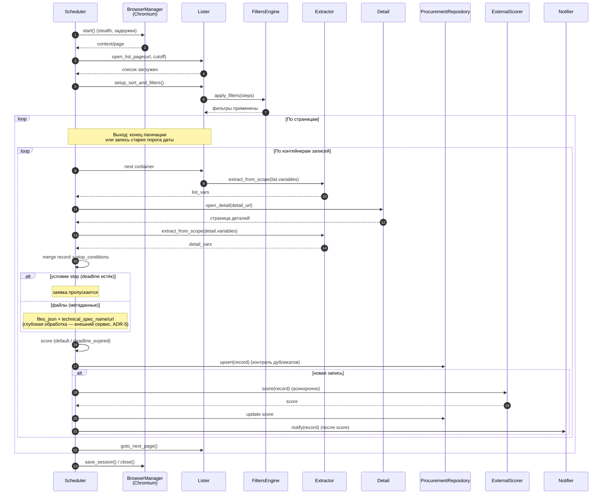

# Диаграмма последовательности — алгоритм парсинга

Последовательность действий парсера для одной площадки (Mermaid sequenceDiagram).
Соответствует `../../src/zakupki_parser/parser/orchestrator.py`.

## Пояснения
- **Выход из цикла страниц** — при достижении конца пагинации или при встрече записи
  с датой публикации **старее** порога. Сравнение — по календарному дню; порог
  берётся из БД (`MAX(update_date)` по площадке), а при отсутствии записей — из
  `default_cutoff_days`.
- **stop_conditions** проверяются после извлечения деталей: если срок приёма заявок истёк
  (или до него меньше `min_deadline_days`) — заявка пропускается (не сохраняется,
  не уведомляется).
- **Файлы**: в основном режиме не скачиваются — сохраняются только метаданные
  (`files_json`, `technical_spec_name/url`). Глубокую обработку (PDF/DOCX/ZIP, поиск ТЗ)
  выполняет **внешний сервис** (ADR-5).
- **Скоринг**: перед записью ставится `default` (или `deadline_expired` для просроченных);
  микросервис скоринга вызывается асинхронно после сохранения, уведомление подписчиков
  происходит только после обновления score (ADR-3/ADR-6).
- **upsert** гарантирует отсутствие повторной записи заявки с тем же номером
  (unique-констрейнт + проверка перед вставкой).
