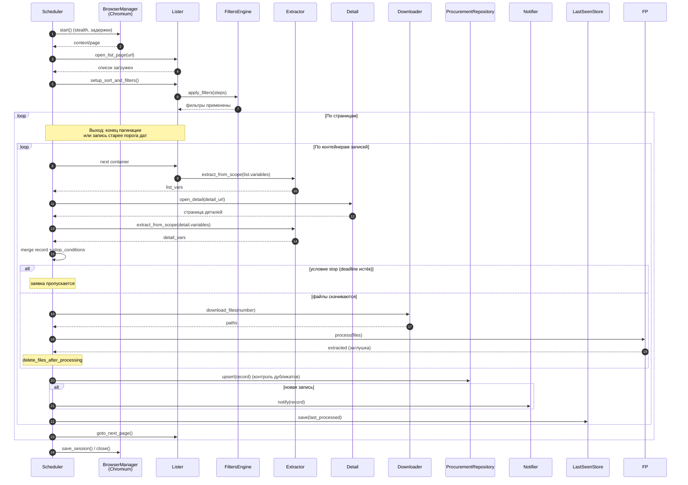

# Диаграмма последовательности — алгоритм парсинга

Последовательность действий парсера для одной площадки (Mermaid sequenceDiagram).
Соответствует `../../src/zakupki_parser/parser/orchestrator.py`.

## Пояснения
- **Выход из цикла страниц** — при достижении конца пагинации или при встрече записи
  с датой обновления **старее** порога `last_processed_date` (по умолчанию «сейчас − 1 неделя»).
- **stop_conditions** проверяются после извлечения деталей: если срок приёма заявок истёк —
  заявка пропускается (не сохраняется, не уведомляется).
- **upsert** гарантирует отсутствие повторной записи заявки с тем же номером
  (unique-констрейнт + проверка перед вставкой).
- Webhook и обработка файлов — сейчас заглушки (лог).
