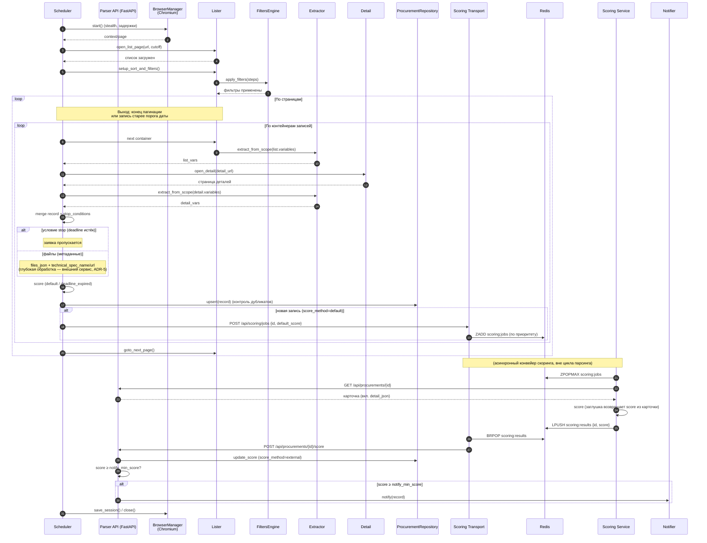

# Диаграмма последовательности — алгоритм парсинга и скоринга

Последовательность действий парсера для одной площадки (Mermaid sequenceDiagram).
Соответствует `../../src/zakupki_parser/parser/orchestrator.py` и конвейеру скоринга
(ADR-7: `scoring_transport` + `scoring_service` + Redis).

## Пояснения
- **Выход из цикла страниц** — при достижении конца пагинации или при встрече записи
  с датой публикации **старее** порога. Сравнение — по календарному дню; порог
  берётся из БД (`MAX(update_date)` по площадке), а при отсутствии записей — из
  `default_cutoff_days`.
- **stop_conditions** проверяются после извлечения деталей: если срок приёма заявок истёк
  (или до него меньше `min_deadline_days`) — заявка пропускается (не сохраняется,
  не уведомляется).
- **Файлы**: в основном режиме не скачиваются — сохраняются только метаданные
  (`files_json`, `technical_spec_name/url`). Глубокую обработку (PDF/DOCX/ZIP, поиск ТЗ)
  выполняет **внешний сервис** (ADR-5).
- **Скоринг (ADR-7)**: при сохранении ставится `default` (или `deadline_expired` для
  просроченных). Для новой записи парсер **автоматически** отправляет задание в транспорт
  (`POST /api/scoring/jobs` с приоритетом = дефолтным score). Дальше конвейер работает
  **асинхронно**: `scoring_service` берёт задание из Redis (`ZPOPMAX`), получает карточку
  через API парсера (`GET /api/procurements/{id}`), считает score и публикует результат;
  транспорт возвращает его в API парсера (`POST /score`). Пока `score_use_stub` включён,
  `scoring_service` возвращает score из карточки без LLM-пайплайна.
- **Уведомление подписчиков** выполняется **в FastAPI-слое** — в обработчике
  `POST /api/procurements/{id}/score` после обновления финального score, только если
  `score ≥ notify_min_score` (порог из конфига). В цикле парсинга уведомлений нет.
- **upsert** гарантирует отсутствие повторной записи заявки с тем же номером
  (unique-констрейнт + проверка перед вставкой).
