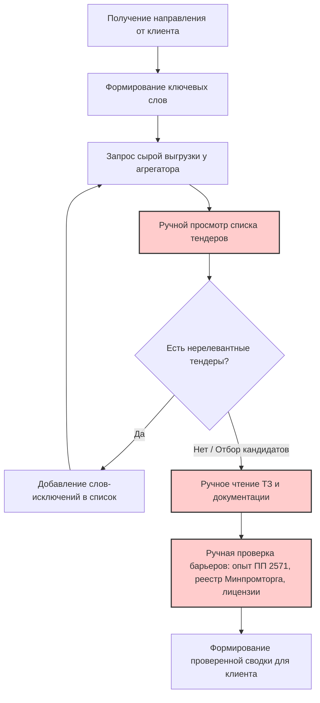
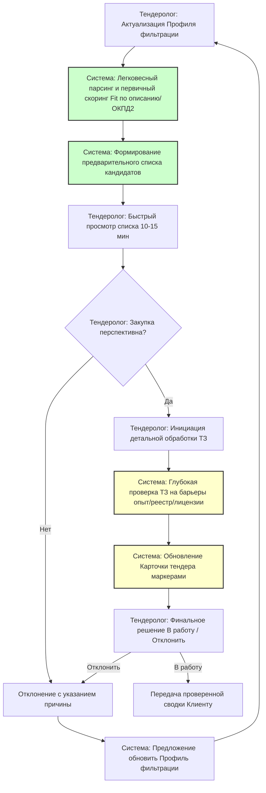

# Модели бизнес-процессов AS-IS и TO-BE

## 1. Модель процесса AS-IS (Текущее состояние)

**Участник**: Тендеролог.
**Цель**: Найти и проверить подходящие тендеры для клиента.
**Проблема**: Высокая трудоемкость (1–1,5 часа в день), риск человеческой ошибки при чтении объемных ТЗ, зависимость от «сырых» данных внешних агрегаторов.

**Шаги процесса**:

- Получить от клиента направление поиска (например, «ИИ и автоматизация»).
- Сформировать начальный список ключевых слов.
- Запросить выгрузку данных у внешнего агрегатора (Tenderplan, Tenderland и др.).
- Вручную просмотреть полученный список тендеров.
- Выявить нерелевантные тендеры → Добавить новые слова-исключения в список (итеративно).
- Для потенциально подходящих тендеров вручную открыть и прочитать документацию (ТЗ).
- Вручную проверить наличие жестких барьеров: требование подтвержденного опыта (ПП РФ № 2571), нюансы реестра Минпромторга («не установлено»), наличие лицензий.
- Сформировать итоговую проверенную сводку и передать клиенту.

## 2. Модель процесса TO-BE (Целевое состояние с системой)
**Участники**: Тендеролог, Система мониторинга и скоринга, Клиент.
**Цель**: Сократить время ручной проверки до 10–15 минут в день, минимизировать пропуск релевантных тендеров, исключить трату времени на заведомо непроходные заявки.
**Шаги процесса**:

- Тендеролог актуализирует Профиль фильтрации (ключевые слова, исключения).
- Система выполняет легковесный парсинг и первичный скоринг (Fit) на основе названия, краткого описания и кодов ОКПД2 (дешевая и быстрая операция).
- Система формирует и доставляет Тендерологу предварительный приоритизированный список кандидатов.
- Тендеролог быстро просматривает этот список (например, за 10–15 минут).
- Для перспективных закупок Тендеролог инициирует детальную обработку (нажимает кнопку «Проанализировать ТЗ» или система делает это автоматически только для этой короткой выборки, если это экономически оправдано).
- Система выполняет глубокую проверку ТЗ на специфические барьеры (опыт, реестр, лицензии) и обновляет Карточку тендера статусными маркерами.
- Тендеролог принимает финальное решение по проверенной карточке («В работу» / «Отклонить»).
- При отклонении Тендеролог указывает причину, Система предлагает добавить новое правило в Профиль фильтрации.

