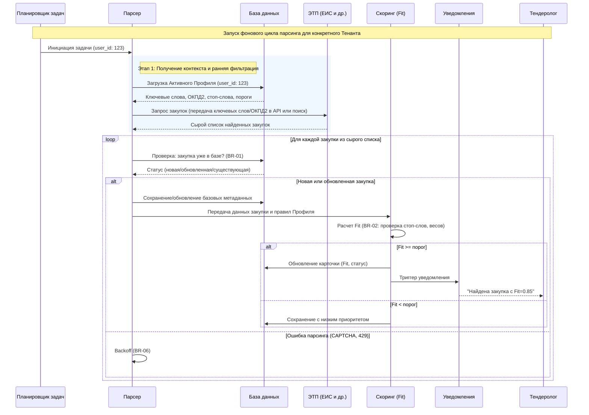
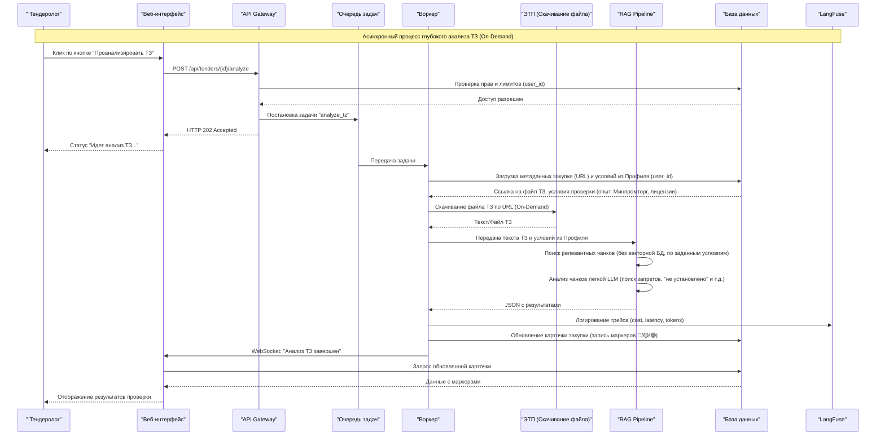
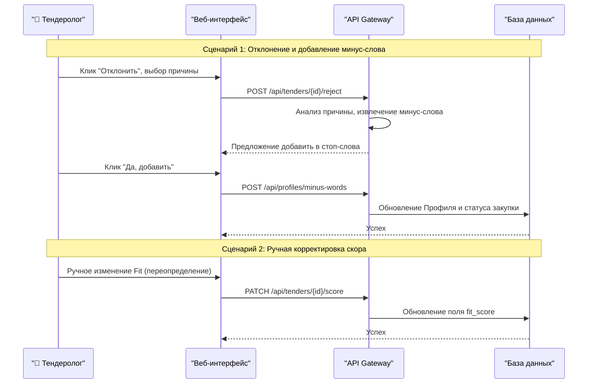

# Диаграммы последовательности

## Диаграмма последовательности процесса парсинга и скоринга

## Диаграмма последовательности детальной проверки ТЗ

# Диаграмма последовательности обратной связи и ручного управления

