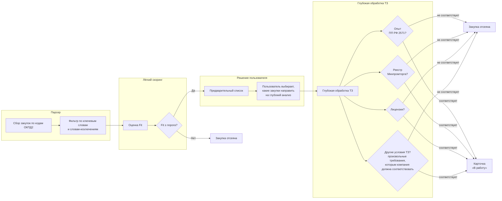

# Диаграмма бизнес-процесса: от сбора закупок до карточки «В работу»

> Назначение: простая демонстрация процесса для бизнес-стейкхолдера.
> Ключевые акценты: глубокий анализ ТЗ запускается **по решению пользователя**;
> отсев по условиям, которым компания не удовлетворяет (опыт, реестр Минпромторга,
> лицензии и любые другие произвольные условия ТЗ).

## Пояснения

- **Парсер** собирает закупки по кодам ОКПД2 и отсеивает по ключевым словам и
  словам-исключениям (клиентская пост-фильтрация до записи в БД).
- **Лёгкий скоринг** — дешёвая оценка Fit: закупки ниже порога не попадают в список.
- **Решение пользователя** — именно пользователь (тендеролог) решает, какие закупки
  из предварительного списка направить на глубокий анализ.
- **Глубокая обработка ТЗ** — анализ текста ТЗ на соответствие условиям компании:
  опыт (ПП РФ 2571), реестр Минпромторга, лицензии, а также любые другие
  произвольные требования. Любого несоответствия достаточно для отсева; закупка
  становится карточкой «В работу» только при выполнении всех условий.
