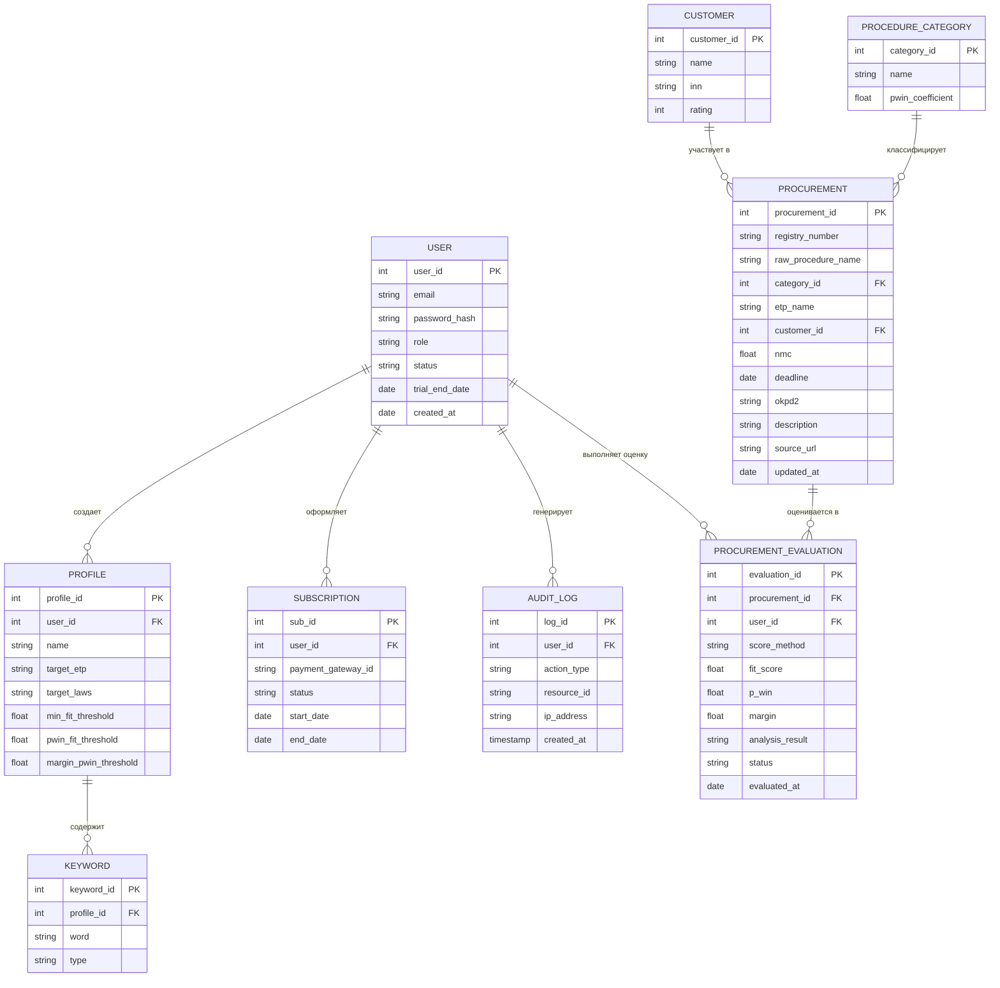

# Концептуальная модель данных (ER-диаграмма)

## Ключевые архитектурные решения в модели:

**Разделение TENDER и TENDER_EVALUATION**:
    Закупка (TENDER) — это публичные данные с ЭТП, они одни и те же для всех. А вот результат скоринга, глубокого анализа и статус («В работе», «Отклонено») уникальны для каждого пользователя. Поэтому мы вынесли пользовательскую оценку в отдельную таблицу TENDER_EVALUATION, связанную и с TENDER, и с USER. Это классический паттерн для SaaS-агрегаторов.
**Таблица KEYWORD**:
    Ключевые слова и стоп-слова вынесены в отдельную сущность, а не хранятся как JSON-строка внутри PROFILE. Это позволяет легко добавлять, удалять и индексировать их на уровне базы данных, а также в будущем реализовать поиск по словам.
**Изоляция через user_id**:
    Во всех таблицах, содержащих приватные данные (PROFILE, TENDER_EVALUATION, SUBSCRIPTION, AUDIT_LOG), присутствует user_id (FK). Это гарантирует, что при любом запросе мы можем отфильтровать данные конкретного тендеролога (реализация бизнес-правила BR-07).
**Аудит и Биллинг**:
    Таблицы AUDIT_LOG и SUBSCRIPTION добавлены для закрытия требований Эпика 7 (жизненный цикл аккаунта) и Эпика 9 (Compliance).
