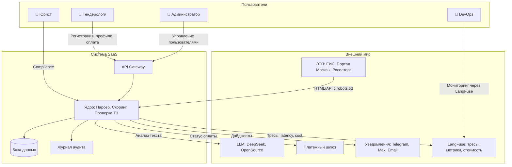

# Контекстная диаграмма системы (Уровень 0)

```mermaid
graph TD
    subgraph External["Внешний мир"]
        ETP["ЭТП: ЕИС, Портал Москвы, Роселторг"]
        LLM["LLM: DeepSeek, OpenSource"]
        PAY["Платежный шлюз"]
        NOTIFY["Уведомления: Telegram, Max, Email"]
        OBS["LangFuse: тресы, метрики, стоимость"]
    end

    subgraph Users["Пользователи"]
        TS["👤 Тендерологи"]
        ADM["👤 Администратор"]
        DEV["👤 DevOps"]
        LAW["👤 Юрист"]
    end

    subgraph System["Система SaaS"]
        API["API Gateway"]
        CORE["Ядро: Парсер, Скоринг, Проверка ТЗ"]
        DB[("База данных")]
        AUDIT["Журнал аудита"]
    end

    ETP -->|"HTML/API с robots.txt"| CORE
    CORE -->|"Анализ текста"| LLM
    CORE -->|"Статус оплаты"| PAY
    CORE -->|"Дайджесты"| NOTIFY
    CORE -->|"Тресы, latency, cost"| OBS

    TS -->|"Регистрация, профили, оплата"| API
    ADM -->|"Управление пользователями"| API
    DEV -->|"Мониторинг через LangFuse"| OBS
    LAW -->|"Compliance"| CORE

    API --> CORE
    CORE --> DB
    CORE --> AUDIT
```
