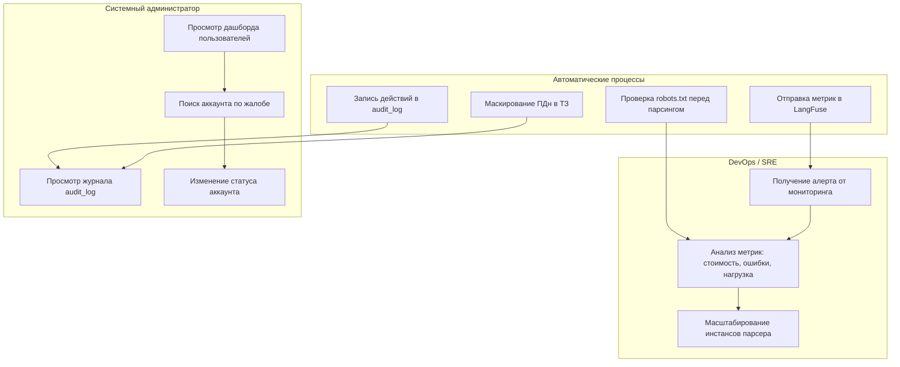

# Диаграмма процесса: Администрирование и Наблюдаемость (Уровень 1)

```mermaid
graph TD
    subgraph DevOps["DevOps / SRE"]
        D1["Получение алерта от мониторинга"]
        D2["Анализ метрик: стоимость, ошибки, нагрузка"]
        D3["Масштабирование инстансов парсера"]
    end

    subgraph Admin["Системный администратор"]
        A1["Просмотр дашборда пользователей"]
        A2["Поиск аккаунта по жалобе"]
        A3["Просмотр журнала audit_log"]
        A4["Изменение статуса аккаунта"]
    end

    subgraph Auto["Автоматические процессы"]
        S1["Запись действий в audit_log"]
        S2["Проверка robots.txt перед парсингом"]
        S3["Маскирование ПДн в ТЗ"]
        S4["Отправка метрик в LangFuse"]
    end

    S1 --> A3
    S2 --> D2
    S3 --> A3
    S4 --> D1
    D1 --> D2
    D2 --> D3
    A1 --> A2
    A2 --> A4

```
