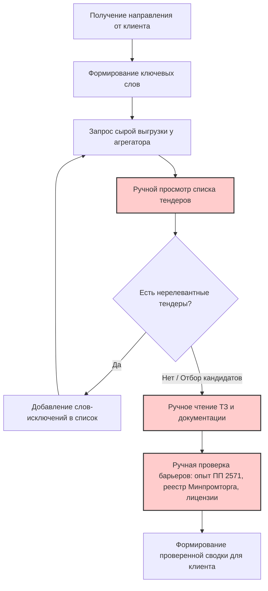
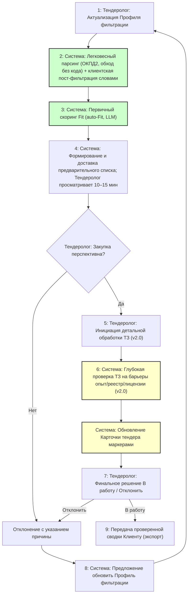

# Модели бизнес-процессов AS-IS и TO-BE

> Источник: user stories (`02_Business_Requirements/01_user_stories.md`) ссылаются на шаги
> «модели TO-BE» (Шаг 1 … Шаг 9). Нумерация шагов TO-BE в этом документе совпадает со
> ссылками в US. Шаги 5–6 — «модель TO-BE v2.0» (детальная проверка ТЗ).

## 1. Модель процесса AS-IS (Текущее состояние)

**Участник**: Тендеролог.
**Цель**: Найти и проверить подходящие тендеры для клиента.
**Проблема**: Высокая трудоемкость (1–1,5 часа в день), риск человеческой ошибки при чтении объемных ТЗ, зависимость от «сырых» данных внешних агрегаторов.

**Шаги процесса**:

- Получить от клиента направление поиска (например, «ИИ и автоматизация»).
- Сформировать начальный список ключевых слов.
- Запросить выгрузку данных у внешнего агрегатора (Tenderplan, Tenderland и др.).
- Вручную просмотреть полученный список тендеров.
- Выявить нерелевантные тендеры → Добавить новые слова-исключения в список (итеративно).
- Для потенциально подходящих тендеров вручную открыть и прочитать документацию (ТЗ).
- Вручную проверить наличие жестких барьеров: требование подтвержденного опыта (ПП РФ № 2571), нюансы реестра Минпромторга («не установлено»), наличие лицензий.
- Сформировать итоговую проверенную сводку и передать клиенту.

## 2. Модель процесса TO-BE (Целевое состояние с системой)

**Участники**: Тендеролог, Система мониторинга и скоринга, Клиент.
**Цель**: Сократить время ручной проверки до 10–15 минут в день, минимизировать пропуск релевантных тендеров, исключить трату времени на заведомо непроходные заявки.

**Шаги процесса** (нумерация совпадает со ссылками в user stories):

1. **Шаг 1 — Актуализация Профиля фильтрации** (Эпик 1): Тендеролог задаёт ключевые
   слова, слова-исключения, целевые ЭТП и законы. Система сохраняет их в профиле
   (таблица `keywords`).
2. **Шаг 2 — Легковесный парсинг** (Эпик 2): Система периодически собирает закупки
   с целевых ЭТП. Серверная фильтрация — только по кодам ОКПД2 (+ обход «без кода»);
   позитивные слова и слова-исключения применяются **клиентски, до записи в БД** (R9).
3. **Шаг 3 — Первичный скоринг (Fit)** (Эпик 2): для сохранённых закупок Система
   запускает внешний скоринг Fit (auto-Fit, LLM-пайплайн) на основе названия, описания
   и кодов ОКПД2; оценка записывается в `procurement_evaluations` под активный профиль.
4. **Шаг 4 — Формирование и доставка предварительного списка** (Эпик 3): Система
   отдаёт Тендерологу приоритизированный по Fit список кандидатов (карточки с базовыми
   полями), уведомляет о высокорелевантных закупках (постадийно, при прохождении порога).
   Тендеролог быстро просматривает список (10–15 минут).
5. **Шаг 5 — Инициация детальной проверки ТЗ** (Эпик 4, v2.0): для перспективных закупок
   Тендеролог нажимает «Проанализировать ТЗ» (или система выполняет анализ для короткой
   выборки, если это экономически оправдано).
6. **Шаг 6 — Глубокая проверка ТЗ и обновление карточки** (Эпик 4, v2.0): Система
   выполняет двухстадийный анализ ТЗ (Stage A — извлечение фактов по обязательным
   системным проверкам «опыт ПП РФ 2571, реестр Минпромторга, лицензии/СРО» и
   пользовательским вопросам профиля; Stage B — сопоставление фактов ТЗ с фактами
   профиля детерминированными правилами) и обновляет Карточку статусными маркерами 🔴/🟡/🟢.
7. **Шаг 7 — Финальное решение по карточке** (Эпик 5): Тендеролог принимает решение
   «В работу» или «Отклонить» (статус фиксируется в оценке закупки).
8. **Шаг 8 — Обратная связь** (Эпик 5): при отклонении Тендеролог указывает причину;
   Система предлагает добавить новое правило в Профиль фильтрации (без автоприменения).
9. **Шаг 9 — Экспорт и передача сводки клиенту** (Эпик 6): Система формирует итоговую
   сводку по карточкам «В работу» и экспортирует её (CSV в MVP; XLSX с маркерами и
   дисклеймером — пост-MVP).

