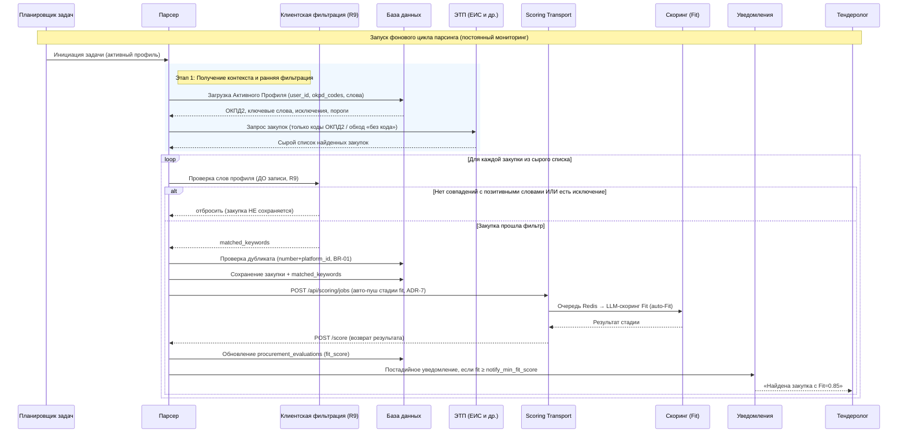
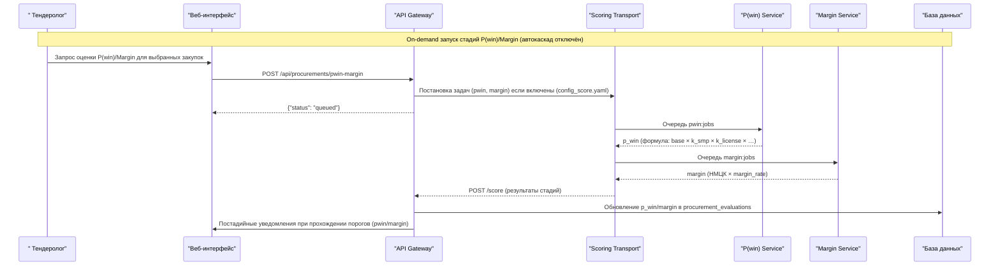
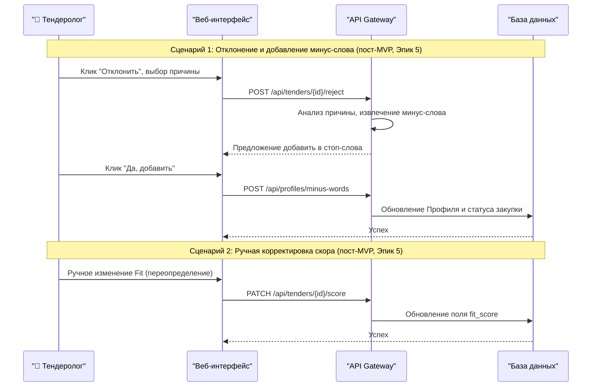

# Диаграммы последовательности

> Синхронизировано с реализацией (этапы 1–3): клиентская пост-фильтрация до записи (R9),
> авто-пуш заданий в `scoring_transport` (ADR-7), постадийные уведомления. Сценарий
> «обратная связь» (ручная корректировка/отклонение) — пост-MVP (этап 7).

## Диаграмма последовательности процесса парсинга и скоринга



## Диаграмма последовательности анализа документов закупки

```mermaid
sequenceDiagram
    participant TS as " Тендеролог"
    participant UI as "Веб-интерфейс"
    participant API as "API Gateway"
    participant QUEUE as "Очередь задач"
    participant WORKER as "Воркер analysis_service"
    participant ETP as "ЭТП (Скачивание файла)"
    participant RAG as "Analysis Pipeline"
    participant DB as "База данных"
    participant OBS as "LangFuse"

    Note over TS,OBS: Асинхронный on-demand анализ документов закупки (US-4.1): отчётные поля + требования к участнику → единый вердикт

    TS->>UI: Клик по кнопке "Анализ"
    UI->>API: POST /api/procurements/analyze
    API->>DB: Проверка прав (активный профиль)
    DB-->>API: Доступ разрешен

    API->>QUEUE: Постановка задачи analysis
    API-->>UI: {"status": "queued"}
    UI-->>TS: Статус "Идет анализ..."

    QUEUE->>WORKER: Передача задачи analysis
    WORKER->>API: GET /api/clients/active (X-Profile-ID)
    API-->>WORKER: report_fields (+ сведения о сайтах условий), requirement_severity, facts (опыт — для BR-03), регионы

    WORKER->>ETP: Скачивание ВСЕХ документов закупки (архивы разворачиваются)
    ETP-->>WORKER: Текст документов (кэш текста — S3)

    rect rgb(240, 248, 255)
    Note over WORKER,RAG: Отчётные поля (FR-12.x, FR-13.7) — LLM только извлекает значения
    WORKER->>RAG: Чанки всех документов + эмбеддинги (1 вызов на закупку)
    RAG->>RAG: По каждому полю: top-k чанков → LLM → значение (параллельно)
    RAG->>RAG: Поле-список: проверка значений по тексту + дополнение (участок, форма кода)
    RAG->>RAG: Окна значений в ТЗ (tz_windows) — связка «код → уточнения»
    RAG->>RAG: Условия полей — код (кроме «по смыслу»); значение-сайт — текст сайта из S3
    end

    rect rgb(255, 250, 235)
    Note over WORKER,RAG: Детерминированная часть (без LLM, кроме заполнения data)
    WORKER->>WORKER: Расстояние до центра региона (гео, кэш координат)
    WORKER->>WORKER: Требования к участнику по всем документам: лицензии, опыт, Минпромторг, соисполнители
    WORKER->>RAG: LLM-заполнение data требований (платная опция)
    WORKER->>WORKER: Сводка по лицензиям (какой вид нужен, есть ли у поставщика)
    WORKER->>WORKER: Вердикт: уровни категорий требований (опыт — BR-03) + поля с severity и match=false → жёсткие / мягкие барьеры
    end

    WORKER->>OBS: Логирование трейса (cost, latency, tokens)
    WORKER->>API: POST /api/procurements/{id}/score (rag_report, auto_rejected, snapshot)
    API->>DB: procurement_evaluations.rag_report, статус (авто-отклонение), p_win = p_win_base × soft_pwin_factor^N
    API->>UI: WebSocket: данные изменились

    UI->>API: Запрос обновленной карточки
    API-->>UI: Отчёт: поля и условия, требования, расстояние, вердикт
    UI-->>TS: Раздел «Анализ документов» + причины авто-отклонения

    Note over TS,UI: Правка условий полей/блокировок и окончание сбора сайта пересчитывают отчёты без LLM
```

## Диаграмма процесса анализа документов закупки

```mermaid
flowchart LR
    DOCS[Все документы закупки] --> CH[split_tz_sections → чанки]
    CH --> EMB[Эмбеддинги чанков<br/>1 вызов на закупку]

    subgraph F[Отчётные поля профиля — LLM извлекает, код проверяет]
        EMB --> TOPK[top-k чанков на поле]
        TOPK --> LLM[LLM: значение поля<br/>field_extract_*.md]
        LLM --> LIST[Список: проверка по тексту,<br/>дополнение участком и формой кода]
        LIST --> WIN[Окна значений в ТЗ<br/>tz_windows]
        WIN --> COND[Условие поля — код:<br/>сравнение / список / сайт + «рядом»]
        SITE[(Текст сайта-источника<br/>S3, site_sources)] --> COND
    end

    subgraph R[Требования к участнику — код]
        DOCS --> REQ[scoring_common.requirements:<br/>лицензии, опыт, Минпромторг,<br/>соисполнители]
        REQ --> DATA[LLM-заполнение data<br/>платная опция]
        DATA --> LIC[Сводка по лицензиям<br/>vs лицензии профиля]
    end

    GEO[Расстояние до центра региона] --> V
    COND --> V[Вердикт: requirement_severity, опыт — BR-03<br/>+ поля с severity и match=false]
    REQ --> V
    V --> RR[rag_report + авто-отклонение жёсткими,<br/>снижение P(win) мягкими — API]
```

> Экономичность: на закупку — 1 эмбеддинг-вызов (чанки документов) и по одному
> LLM-вызову на отчётное поле (у поля-списка — не больше одного дополнительного,
> если LLM не видела участок документа со списком целиком). Условия, требования,
> вердикт и их пересчёт — чистый код.

## Диаграмма последовательности on-demand P(win)/Margin



# Диаграмма последовательности обратной связи и ручного управления (пост-MVP, этап 7)

