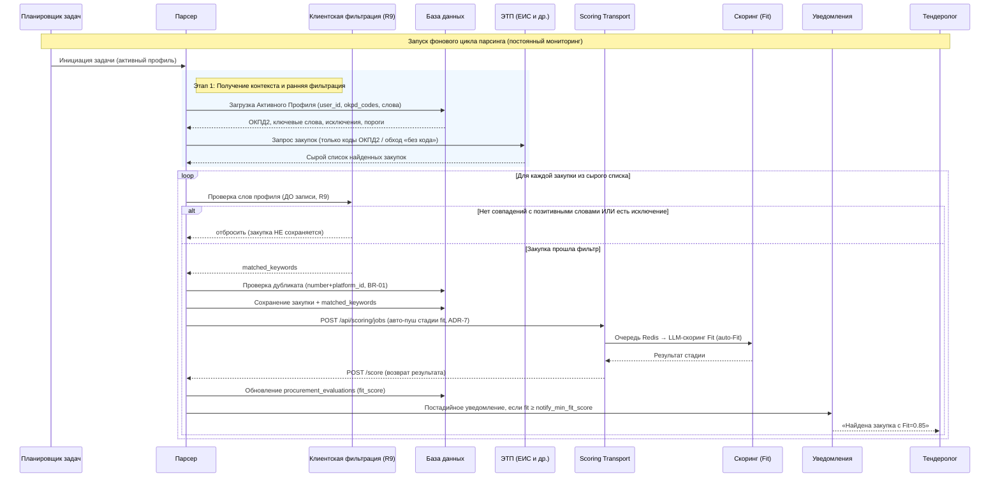
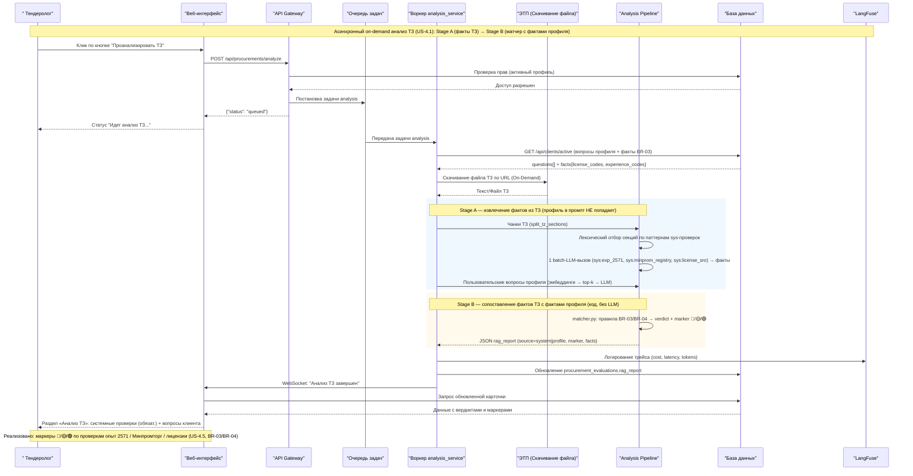
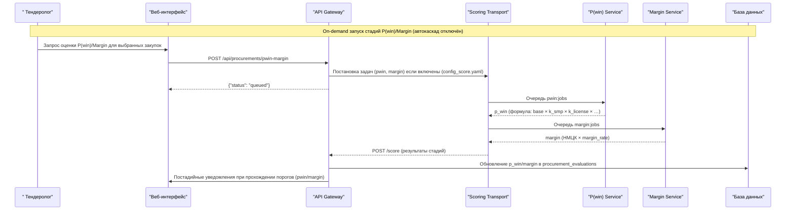
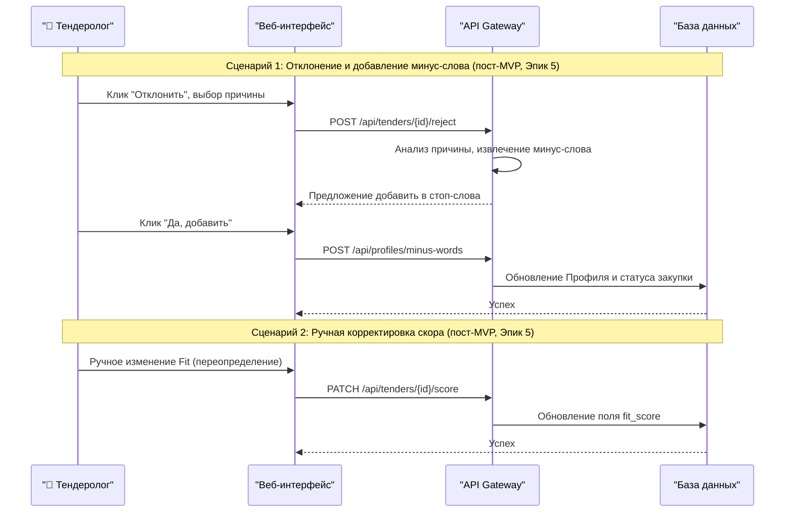

# Диаграммы последовательности

> Синхронизировано с реализацией (этапы 1–3): клиентская пост-фильтрация до записи (R9),
> авто-пуш заданий в `scoring_transport` (ADR-7), постадийные уведомления. Сценарий
> «обратная связь» (ручная корректировка/отклонение) — пост-MVP (этап 7).

## Диаграмма последовательности процесса парсинга и скоринга



## Диаграмма последовательности детальной проверки ТЗ (двухстадийный анализ)



## Диаграмма процесса двухстадийного анализа ТЗ (Stage A / Stage B)

```mermaid
flowchart LR
    TZ[Текст ТЗ] --> CH[split_tz_sections → чанки]
    CH --> EMB[Эмбеддинги чанков<br/>1 вызов на карточку]

    subgraph A[Stage A — факты ТЗ (LLM, on-demand)]
        LEX[Лексический ретривал секций<br/>по паттернам sys-проверок]
        CH --> LEX
        LEX -->|нет совпадений| SKIP[sys-вердикты no_stop_condition<br/>LLM не вызывается]
        LEX -->|релевантные секции| BATCH[1 batch-LLM-вызов<br/>batch_system.md]
        BATCH --> F1[Факты: опыт 2571,<br/>реестр Минпромторга, лицензии/СРО]
        EMB --> RETR[top-k по эмбеддингам]
        CH --> RETR
        RETR --> USERQ[Per-question LLM-вызовы<br/>пользовательские вопросы]
        USERQ --> VUSER[Вердикты пользовательских вопросов]
    end

    subgraph B[Stage B — сопоставление с профилем (код, ≈$0)]
        PF[Факты профиля:<br/>license_codes, experience_codes<br/>GET /api/clients/active → facts] --> MATCH
        F1 --> MATCH[matcher.py<br/>правила BR-03/BR-04/US-4.4]
        MATCH --> VSYS[Вердикты sys-проверок<br/>+ marker 🔴/🟡/🟢]
        MATCH -->|вид лицензии не распознан| SOFT[soft «требует проверки»]
    end

    VSYS --> RAG[rag_report: verdict, marker,<br/>source system/profile, facts]
    VUSER --> RAG
    SKIP --> VSYS
```

> Экономичность: эмбеддинги системных вопросов не вычисляются (лексический ретривал);
> на типовую карточку — 1 эмбеддинг-вызов (чанки) + 1 batch-LLM-вызов (системные проверки)
> + редкие вызовы на пользовательские вопросы; Stage B — чистый код.

## Диаграмма последовательности on-demand P(win)/Margin



# Диаграмма последовательности обратной связи и ручного управления (пост-MVP, этап 7)

