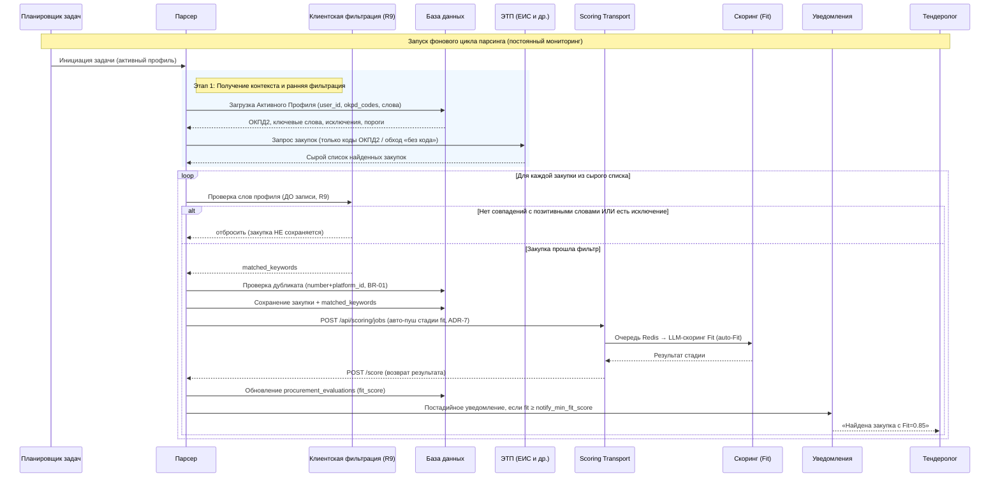
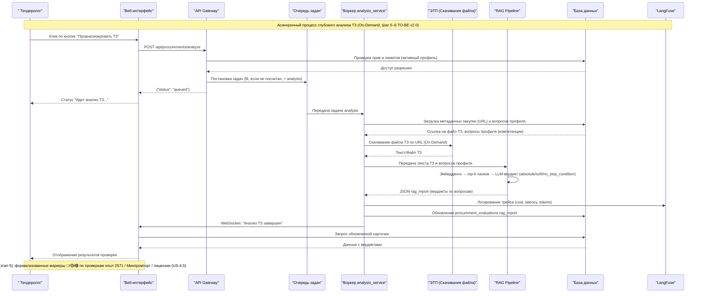
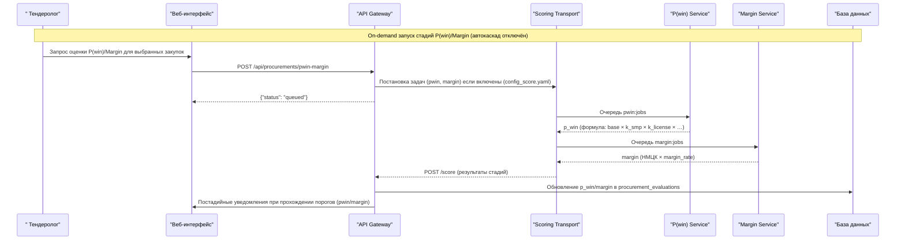
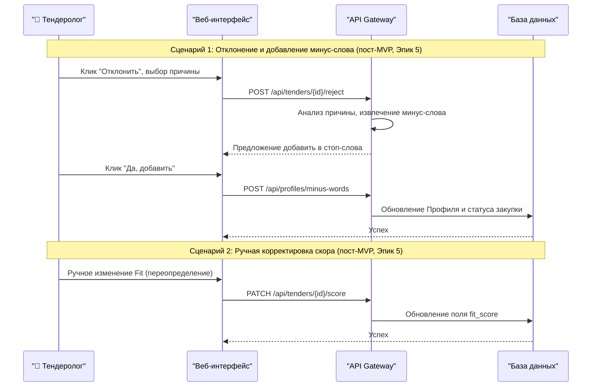

# Диаграммы последовательности

> Синхронизировано с реализацией (этапы 1–3): клиентская пост-фильтрация до записи (R9),
> авто-пуш заданий в `scoring_transport` (ADR-7), постадийные уведомления. Сценарий
> «обратная связь» (ручная корректировка/отклонение) — пост-MVP (этап 7).

## Диаграмма последовательности процесса парсинга и скоринга

## Диаграмма последовательности детальной проверки ТЗ

## Диаграмма последовательности on-demand P(win)/Margin

# Диаграмма последовательности обратной связи и ручного управления (пост-MVP, этап 7)

