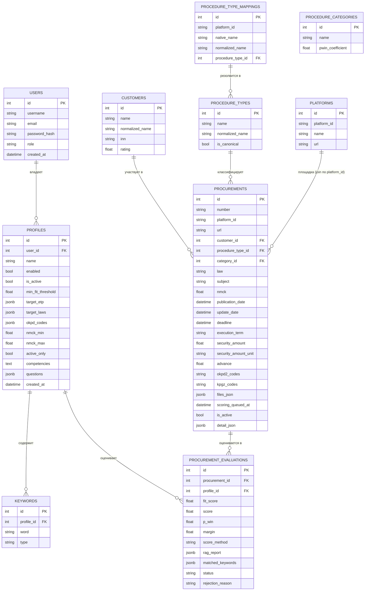

# Концептуальная модель данных (ER-диаграмма)

> Источник: фактическая схема БД (`src/zakupki_parser/storage/db.py`, Liquibase-миграции
> 1.29–1.35) и целевая модель TenderSearch (`specification.md` §14.2).
> Раздел 1 — **текущая (фактическая) модель**; раздел 2 — **целевая модель (пост-MVP)**
> с сущностями `SUBSCRIPTION`, `AUDIT_LOG` и наполнением `PROCEDURE_CATEGORIES`.

## 1. Фактическая модель данных (реализована, этапы 1–3)

### Ключевые решения фактической модели

- **Разделение PROCUREMENT и PROCUREMENT_EVALUATIONS**: закупка — публичные данные ЭТП
  (одни для всех), а результат скоринга, RAG-отчёт и статус уникальны для
  **профиля фильтрации** (профиль — пользователю). Оценки хранятся только в
  `procurement_evaluations`; колонок score-* в `procurements` нет (динамические
  атрибуты подкладываются репозиторием при выдаче под активный профиль).
- **Таблица KEYWORDS** — канонический источник слов профиля (`keyword`/`exclusion`);
  JSONB-массивов слов в профиле нет (миграция 1.30).
- **Критерии поиска в профиле** (миграция 1.33): `okpd_codes`, `nmck_min/max`,
  `active_only` принадлежат профилю, а не глобальному конфигу.
- **Ключи уникальности**: `procurements (number, platform_id)`;
  `procurement_evaluations (procurement_id, profile_id)`; `keywords (profile_id, word, type)`.
- **Справочники**: `customers`, `procedure_types` (+ `procedure_type_mappings`),
  `platforms`; `procedure_categories` — заглушка (этап 1).
- **Изоляция через user_id / profile_id** (BR-07): все таблицы с приватными данными
  (`profiles`, `procurement_evaluations`) привязаны к пользователю/профилю; tenant-скоуп
  реализован в репозитории.

## 2. Целевая модель (пост-MVP, этапы 6–10)

Дополнения к фактической модели (миграции этапов 6/9/10; «заглушки» созданы на этапе 1):

- `users.status` (`trial|active|frozen|deleted`), `trial_end_date` (= now()+10 лет) —
  жизненный цикл аккаунта (BR-05, этап 6); подтверждение email — целевая модель, в MVP
  не реализуется.
- `subscriptions` — оплата/подписка (в MVP **не обязательна**, заглушка).
- `audit_log` — аудит критичных действий пользователей с IP (US-9.4, этапы 6/9/10).
- `procedure_categories.pwin_coefficient` — наполняется и используется в формуле P(win)
  (этап 10 / калибровка скоринга).
