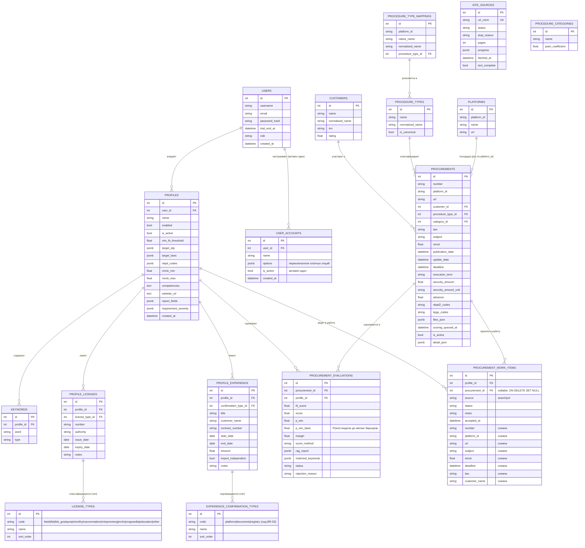
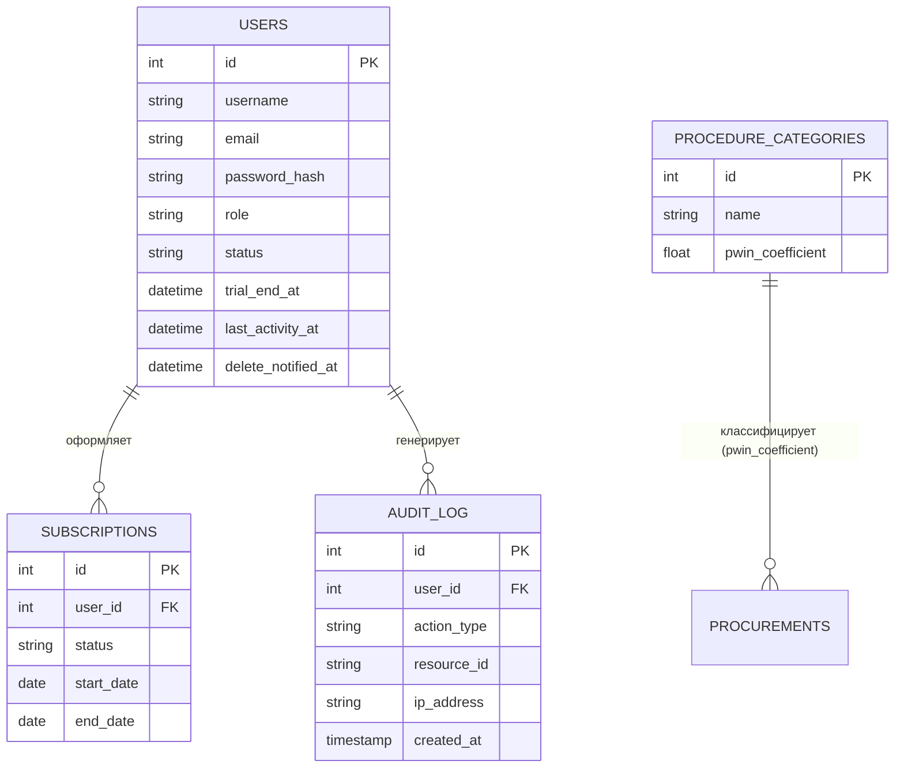

# Концептуальная модель данных (ER-диаграмма)

> Источник: фактическая схема БД (`src/zakupki_parser/storage/db.py`, Liquibase-миграции
> 1.29–1.35) и целевая модель TenderSearch (`specification.md` §14.2).
> Раздел 1 — **текущая (фактическая) модель**; раздел 2 — **целевая модель (пост-MVP)**
> с сущностями `SUBSCRIPTION`, `AUDIT_LOG` и наполнением `PROCEDURE_CATEGORIES`.

## 1. Фактическая модель данных (реализована, этапы 1–3)

### Ключевые решения фактической модели

- **Разделение PROCUREMENT и PROCUREMENT_EVALUATIONS**: закупка — публичные данные ЭТП
  (одни для всех), а результат скоринга, RAG-отчёт и статус уникальны для
  **профиля фильтрации** (профиль — пользователю). Оценки хранятся только в
  `procurement_evaluations`; колонок score-* в `procurements` нет (динамические
  атрибуты подкладываются репозиторием при выдаче под активный профиль).
- **Таблица KEYWORDS** — канонический источник слов профиля (`keyword`/`exclusion`);
  JSONB-массивов слов в профиле нет (миграция 1.30).
- **Решения по карточке (Эпик 5, этап 7)**: отбраковка — `procurement_evaluations.status`
  (`new`/`rejected`, колонка зарезервирована с этапа 1) + `rejection_reason`;
  отклонённые скрываются из выдачи. «В работу» — таблица `procurement_work_items`
  на уровне профиля (`profile_id`, BR-07): `procurement_id` — FK `ON DELETE SET NULL`,
  ключевые поля карточки хранятся снимком в записи (BR-08) — запись переживает
  удаление закупки из общей базы (например, очистку БД девопсом).
- **Критерии поиска в профиле** (миграция 1.33): `okpd_codes`, `nmck_min/max`
  принадлежат профилю, а не глобальному конфигу. Выбор по состоянию
  (`active_only`) — глобальный (`config_service.yaml -> search_criteria.active_only`);
  колонка `profiles.active_only` удалена (миграция 1.36).
- **Ключи уникальности**: `procurements (number, platform_id)`;
  `procurement_evaluations (procurement_id, profile_id)`; `keywords (profile_id, word, type)`;
  `license_types (code)`; `experience_confirmation_types (code)`.
- **Справочники**: `customers`, `procedure_types` (+ `procedure_type_mappings`),
  `platforms`; `procedure_categories` — заглушка (этап 1).
- **Лицензии и подтверждённый опыт профиля** (миграция 1.37, BR-03): `profile_licenses`
  и `profile_experience` — дочерние таблицы профиля (FK `ON DELETE CASCADE`, как
  `keywords`). Тип лицензии — справочник `license_types` (сид: набор для ИТ-компании);
  тип подтверждения опыта — справочник `experience_confirmation_types` (сид BR-03:
  `platform` — через площадку ПП 2571, `documents` — сканы договоров/актов,
  `registry` — выписка из реестра контрактов). `profile_experience.import_independent` —
  nullable boolean соответствия требованию Минпромторга об импортонезависимости
  (NULL — неизвестно/не применимо). CRUD — вложенные эндпоинты
  `/api/clients/{id}/licenses` и `/api/clients/{id}/experience` (tenant-скоуп BR-07).
- **Отчётные поля, условия и факты анализа**: `profiles.report_fields` (jsonb) —
  поля, значения которых извлекаются из документов закупки, с условием
  `{op, value_kind, value, near?}` и уровнем барьера `severity` (`block`/`soft`;
  FR-13.7; условие проверяет код, кроме `op=llm`). Значение-сайт (`value_kind=url`) проверяется по тексту
  сайта-источника: статус сбора — `site_sources`, текст — объектное хранилище
  (FR-13.8). `procurement_evaluations.rag_report.fields[]` — значения полей и итог
  проверки условий; требования к участнику (лицензии/опыт/Минпромторг/
  соисполнители) — детерминированно, `procurements.requirements_json`; факты
  профиля для сопоставления (коды лицензий/опыта) собираются из
  `profile_licenses` + `profile_experience` (`get_profile_facts`) и отдаются
  конвейеру в `GET /api/clients/active` → `facts`.
- **Уровни барьеров и BR-03** (миграция 1.70): `profiles.requirement_severity` —
  уровень категорий требований (`block`/`soft`/`off`; опыт — `br03`/`off`: уровень
  решает способ подтверждения опыта и опыт профиля `platform`). Жёсткий барьер —
  авто-отклонение; мягкие (`rag_report.verdict.soft_reasons`) снижают P(win):
  `p_win = p_win_base × soft_pwin_factor^N`, `p_win_base` — P(win) модели.
- **Изоляция через user_id / profile_id** (BR-07): все таблицы с приватными данными
  (`profiles`, `procurement_evaluations`, `profile_licenses`, `profile_experience`)
  привязаны к пользователю/профилю; tenant-скоуп реализован в репозитории.
- **Аккаунты пользователя и триал (Эпик 10, BR-09)**: `users.trial_end_at` — окончание
  триал-режима (self-registered — по умолчанию now()+14 дней; в триале все опции поиска
  и скоринга бесплатны). `user_accounts` — именованные наборы платных опций (`options` —
  jsonb-переключатели: scoring, analysis_embeddings, analysis, pwin, margin; отложенное
  платное гео — в каталоге `options.py`, не подключается); активен один аккаунт
  (уникальность `(user_id, name)`). По окончании триала доступность платных операций
  определяется активным аккаунтом (по умолчанию — только бесплатные опции).
  Заморозка/удаление (`users.status` frozen/deleted) и `subscriptions` — целевая модель
  (раздел 2).

## 2. Целевая модель (пост-MVP, этапы 6–10)

Дополнения к фактической модели (миграции этапов 6/9/10; «заглушки» созданы на этапе 1):

- `users.status` (`frozen|deleted` — целевая модель BR-05, этап 6): в текущей
  реализации пользователь не замораживается после trial — происходит перевод на опции
  активного аккаунта (BR-09); `users.trial_end_at` по умолчанию = now()+14 дней
  (реализовано). Подтверждение email — целевая модель, в MVP не реализуется.
- `subscriptions` — оплата/подписка (в MVP **не обязательна**, заглушка).
- `audit_log` — аудит критичных действий пользователей с IP (US-9.4, этапы 6/9/10).
- `procedure_categories.pwin_coefficient` — наполняется и используется в формуле P(win)
  (этап 10 / калибровка скоринга).
