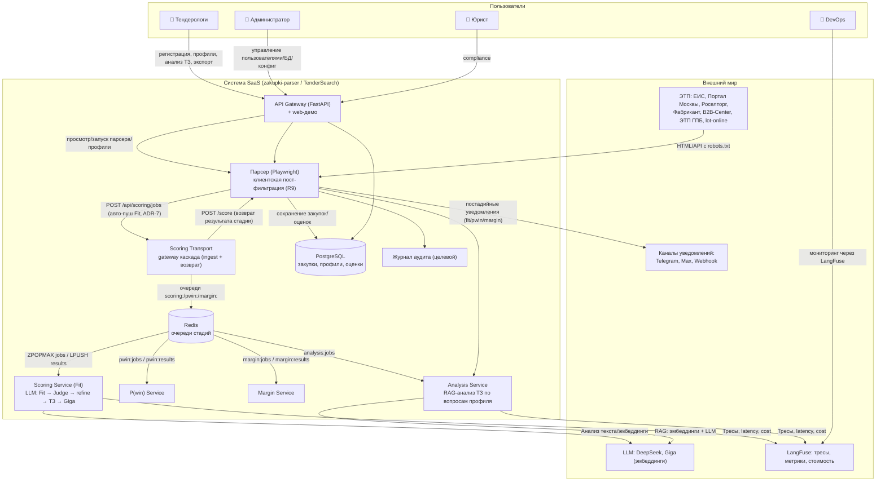

# Контекстная диаграмма системы (Уровень 0)

> Синхронизировано с `docs/c4/context.md` и `docs/c4/container.md` (актуализировано
> 2026-08-24). Отражён фактический контур: каскад Fit → P(win) → Margin, Redis,
> LangFuse, постадийные уведомления.

## Легенда

- **Парсер** — сбор закупок по ОКПД2 (клиентская пост-фильтрация словами до записи, R9),
  дедуп, авто-пуш заданий Fit в Scoring Transport (ADR-7).
- **Scoring Transport** — единственная граница между конвейером и парсером: ingest
  (`POST /api/scoring/jobs`) и возврат результата (`POST /score`).
- **Каскад Fit → P(win) → Margin** — отдельные stateless-воркеры за Redis-очередями;
  автокаскад отключён, P(win)/Margin — on-demand по запросу тендеролога.
- **Analysis Service** — on-demand RAG-анализ ТЗ по вопросам профиля (вердикты
  absolute/soft/no_stop_condition).
- **Уведомления** — постадийные (после fit/pwin/margin) при прохождении порога
  (`notify_min_fit_score`/`notify_min_pwin`/`notify_min_margin`).
- **Аудит** — целевая сущность (этап 6/9/10).
