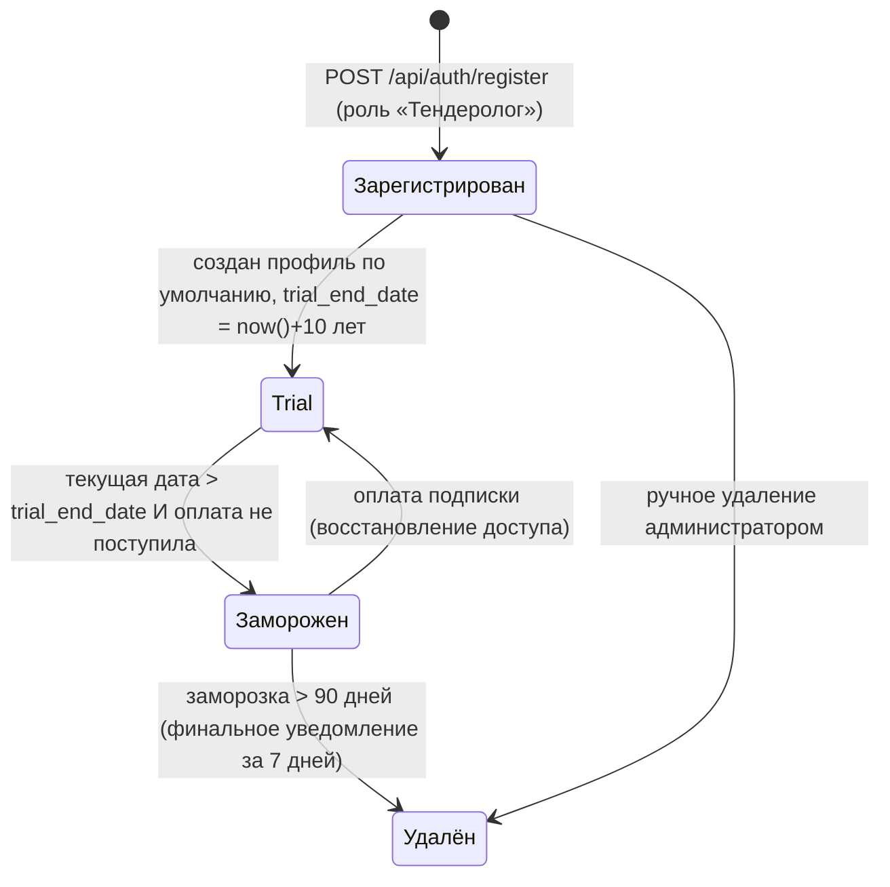

# Диаграмма жизненного цикла

> Синхронизировано с реализацией: статусы — по фактическим полям БД
> (`procurement_evaluations.status`, `procurements.is_active`, целевой `users.status`).
> Раздел 1 — жизненный цикл **закупки** (BR-01); раздел 2 — жизненный цикл **аккаунта**
> (BR-05, этап 6, пост-MVP).

## 1. Жизненный цикл закупки

### Пояснения

- **Новая** — закупка сохранена в БД (`procurements`), оценка `procurement_evaluations.status='new'`.
- **Оценена** — по каждой сохранённой закупке парсер авто-пушит задание Fit в
  `scoring_transport` (ADR-7); результат пишется в `procurement_evaluations.fit_score`.
- **Высокорелевантная** — `fit_score ≥ min_fit_threshold`; постадийное уведомление
  тендеролога (US-3.1).
- **Анализ ТЗ** — on-demand (US-4.1); в MVP — RAG-вердикты по вопросам профиля, целевой
  этап 5 — формализованные маркеры 🔴/🟡/🟢.
- **В работе / Отклонена** — целевая модель (Эпик 5, этап 7); в MVP оценка всегда
  `status='new'`, ручные решения недоступны.
- **Архив** — определяется статусом ЭТП («Работа завершена» / «Контракт заключен») и
  флагом `is_active`; архивные закупки исключаются из активных выдач (BR-01).
- **Повторный парсинг** неизменившейся закупки (та же `update_date`) пропускается —
  дедуп по `(number, platform_id)` и ранний пропуск по `total_results` (BR-01).

## 2. Жизненный цикл аккаунта (BR-05, этап 6 — пост-MVP)

### Пояснения

- **Trial** — в MVP trial-период **10 лет** (US-7.2), оплата **не обязательна**;
  механика заморозки фактически не срабатывает (US-7.3/7.4).
- **Заморожен** — доступ к функционалу закрыт, данные сохранены; предупреждения за
  7/3/1 день до конца trial (US-7.4).
- **Удалён** — физическое удаление данных через 90 дней заморозки с уведомлением за
  7 дней (US-7.5).
- Колонки `users.status`, `trial_end_date`, `last_activity_at`, `delete_notified_at` —
  целевая модель (этап 6); `subscriptions` — заглушка.
