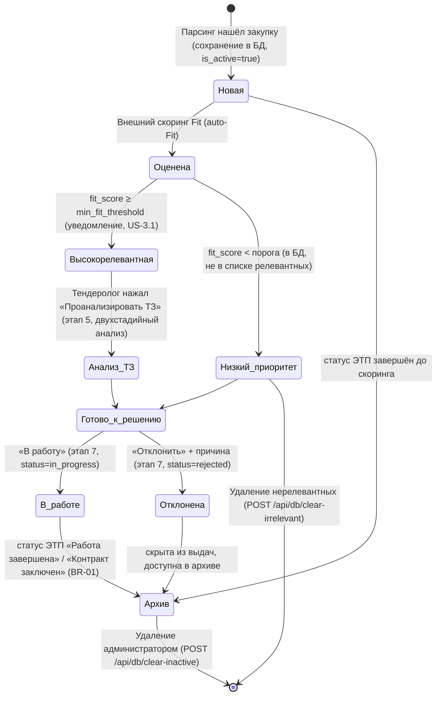

# Диаграмма жизненного цикла

> Синхронизировано с реализацией: статусы — по фактическим полям БД
> (`procurement_evaluations.status`, `procurements.is_active`, целевой `users.status`).
> Раздел 1 — жизненный цикл **закупки** (BR-01); раздел 2 — жизненный цикл **аккаунта**
> (BR-05, этап 6, пост-MVP).

## 1. Жизненный цикл закупки

### Пояснения

- **Новая** — закупка сохранена в БД (`procurements`), оценка `procurement_evaluations.status='new'`.
- **Оценена** — по каждой сохранённой закупке парсер авто-пушит задание Fit в
  `scoring_transport` (ADR-7); результат пишется в `procurement_evaluations.fit_score`.
- **Высокорелевантная** — `fit_score ≥ min_fit_threshold`; постадийное уведомление
  тендеролога (US-3.1).
- **Анализ ТЗ** — on-demand (US-4.1): двухстадийный анализ — Stage A (факты ТЗ:
  обязательные системные проверки опыт 2571 / реестр Минпромторга / лицензии одним
  batch-LLM-вызовом + вопросы профиля), Stage B (матчер фактов ТЗ с фактами профиля,
  код) → вердикты и маркеры 🔴/🟡/🟢 в карточке.
- **В работе / Отклонена** — целевая модель (Эпик 5, этап 7); в MVP оценка всегда
  `status='new'`, ручные решения недоступны.
- **Архив** — определяется статусом ЭТП («Работа завершена» / «Контракт заключен») и
  флагом `is_active`; архивные закупки исключаются из активных выдач (BR-01).
- **Повторный парсинг** неизменившейся закупки (та же `update_date`) пропускается —
  дедуп по `(number, platform_id)` и ранний пропуск по `total_results` (BR-01).

## 2. Жизненный цикл аккаунта: триал и аккаунты опций (BR-05/BR-09)

```mermaid
stateDiagram-v2
    [*] --> Зарегистрирован: POST /api/auth/register (роль «Тендеролог»)

    Зарегистрирован --> Trial: trial_end_at = now()+14 дней (TRIAL_DEFAULT_DAYS)
    Trial --> Аккаунт_опций: trial_end_at истёк → действуют опции активного аккаунта (по умолчанию только бесплатные)

    Аккаунт_опций --> Аккаунт_опций: пользователь/админ меняют платные опции или переключают активный аккаунт (личный кабинет / «Опции» админа)
    Зарегистрирован --> Аккаунт_опций: пользователь создан администратором (default-аккаунт «полный», без триала)

    Trial --> Заморожен: (целевая модель BR-05) дата > trial_end_at И оплата не поступила
    Заморожен --> Аккаунт_опций: оплата подписки / решение администратора (целевая модель)
    Заморожен --> Удалён: заморозка > 90 дней (финальное уведомление за 7 дней; целевая модель)
    Зарегистрирован --> Удалён: ручное удаление администратором
```

### Пояснения

- **Trial** — по умолчанию 14 дней (`TRIAL_DEFAULT_DAYS`, `users.trial_end_at`): все
  реализованные опции поиска и скоринга доступны бесплатно; в шапке/кабинете —
  плашка «триал N дн.» (US-10.6).
- **Аккаунт опций** — доступность платных операций определяется активным аккаунтом
  (`user_accounts.options`, BR-09); по умолчанию аккаунт включает только бесплатные
  опции; пользователь сам переключает активный аккаунт в личном кабинете, админ —
  во вкладке «Пользователи» → «Опции» (US-10.1–10.5, US-10.8). Недоступные платные
  операции не выполняются (в т.ч. фоновый сбор/recovery, US-10.9).
- **Заморожен / Удалён** — целевая модель (BR-05, пост-MVP): колонки `users.status`,
  `last_activity_at`, `delete_notified_at`, уведомления 7/3/1 день (US-7.3–7.5);
  `subscriptions` — целевая модель.
