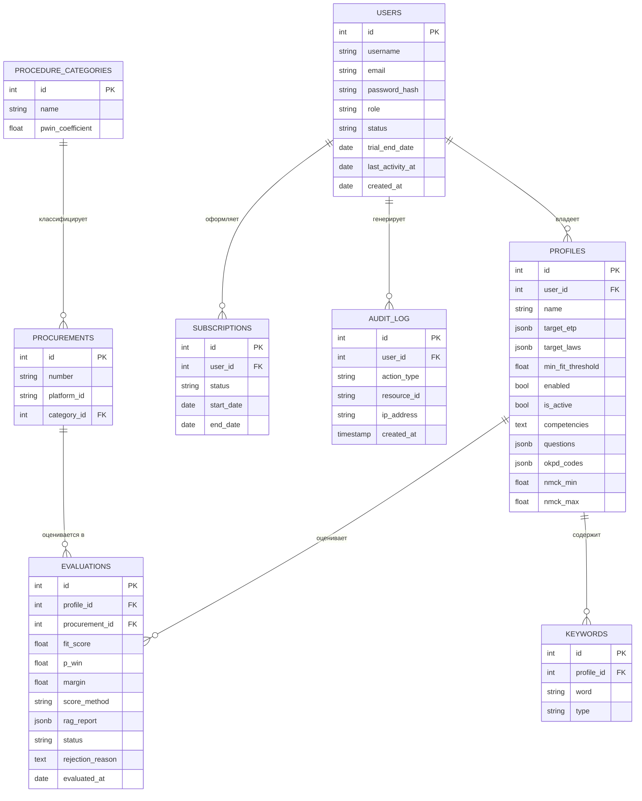

# Спецификация парсера площадок закупок

> **Статус: текущее состояние (v0.3.0).** Целевая архитектура — мультитенантный SaaS
> «TenderSearch» по `docs/system_analysis/` (требования, ER, NFR) — и roadmap этапов
> перестройки описаны в разделе [14. Целевая архитектура (TenderSearch)](#14-целевая-архитектура-tendersearch).
> Этапы перестройки и статусы — в `plans/plan.md`, детальные планы — в `plans/00_plan.md`+.

## 1. Назначение
Сервис автоматически собирает информацию о закупках с платформ госзакупок и
коммерческих тендеров, сохраняет её в PostgreSQL и оповещает подписчиков.
Парсинг выполняется через браузер Playwright (Chromium). Все параметры парсера
задаются исключительно через YAML-конфиги в каталоге `configs/`.

Эталонная площадка первого конфига — **Портал поставщиков Москвы (zakupki.mos.ru)**.
Тематика — ИТ-услуги (обследование/аудит, ИИ и автоматизация, разработка).

Поддерживаемые площадки (`configs/dom/<platform_id>.yaml`, по файлу на площадку):
- `zakupki_mos` — Портал поставщиков Москвы;
- `zakupki_gov_44fz`, `zakupki_gov_223fz` — ЕИС (zakupki.gov.ru; раздельно по законам,
  разные структуры детальных страниц);
- коммерческие ЭТП (конфиги добавлены; статус верификации и `enabled` — в
  [docs/platforms.md](docs/platforms.md)): `roseltorg_44fz`, `roseltorg_223fz`,
  `fabrikant`, `b2b_center`, `etpgpb`, `lot_online_44`, `lot_online_223`.

Статус верификации селекторов, механика фильтрации/сортировки по каждой площадке —
в [docs/platforms.md](docs/platforms.md).

Сравнительный анализ формирования URL-запросов, фильтрации по ОКПД2/словам и
сортировки по релевантности на всех площадках — в плане
`.kilo/plans/1786484077646-commercial-etps-addition-plan.md` (§2).

## 2. Состав конфигурационных файлов
| Файл                 | Назначение                                                          |
|----------------------|---------------------------------------------------------------------|
| `config_parser.yaml` | Параметры браузера и антиблок-мер (задержки, UA, stealth, лимиты), потолок страниц списка за проход `max_list_pages`. |
| `dom/` (`<platform_id>.yaml`) | URL площадки, имена переменных, селекторы контейнеров и значений, селекторы сортировки и фильтров (блоки `sort`/`filters`), пагинация (`page_param`/`page_size`/`next_page`) и селектор общего числа результатов (`total_results_selector`/`total_results_regex`). |
| `config_service.yaml`| **Аналитические** настройки: список сайтов (`sites`), порог дат (`default_cutoff_days`), критерии поиска (`search_criteria`), stop-условия. |
| `config_ops.yaml`    | **Эксплуатационные** настройки (devops): таймер (`timeout_seconds`), БД (`db`), уведомления (`notifications`, постадийные пороги и флаги `notify_min_fit_score`/`notify_min_pwin`/`notify_min_margin`, `notify_{fit,pwin,margin}_enabled`), `export_dir` (каталог выгрузки CSV), параметры circuit breaker. Управляется devops, через API не редактируется. |
| `config_score.yaml`  | Скоринг: fit-таблица ОКПД2, `default_fit`, `empty_code_fit`, `p_win`, `margin_rate`, адрес транспорта `scoring_transport_url`. Дефолтный score и `fit_score` вычисляются в парсере; внешний score приходит через конвейер transport + scoring_service (ADR-7). |
| `config_log.yaml`    | Конфигурация логирования.                                           |

Все параметры загружаются и валидируются через pydantic-модели
(`src/zakupki_parser/config/`). Настройки селекторов выносятся в конфиг, чтобы
правки DOM площадки не требовали изменения кода.

## 3. Алгоритм работы парсера (оркестратор)
Последовательность для одной площадки:

1. **Вход на сайт** платформы (страница списка).
2. **Сортировка** закупок по убыванию даты публикации (пункт «По дате публикации»
   в выпадающем списке сортировки, см. `configs/dom/<platform_id>.yaml -> sort`).
   **Порядок фиксирован** (`sort.order: publication_date_desc`, единственное допустимое
   значение в схеме) — на нём основана стоп-логика по дате (последняя обработанная
   дата); другие порядки исключены. Площадки, допускающие сортировку по релевантности,
   при `config_service.yaml -> sort_by_date_only=true` тоже сортируются по дате; при
   `false` (по умолчанию) они сортируются по релевантности (`sort.by_relevance=true`)
   без стоп-порога. Поле даты выбирается автоматически: **дата обновления**, если
   площадка её поддерживает (переменная `update_date` в карточке списка), иначе
   **дата публикации**.
3. **Применение фильтров**. Поддерживается два механизма:
   - **URL-фильтр** (для площадок типа zakupki.mos.ru): параметр `filter` (JSON)
     строится из `configs/dom/<platform_id>.yaml -> search` — имена query-параметров, структуры
     `filter_json`/`state_json` и формат даты задаются только в конфиге; плейсхолдер
     `{publish_date_great_equal}` подставляется датой порога (cutoff).
   - **DOM-шаги** (`configs/dom/<platform_id>.yaml -> filters`) — для площадок с панелью фильтров
     (клик/fill/select по заданным селекторам).

   **ОКПД2**: фильтр по кодам ОКПД2 задаётся человекочитаемыми кодами любой
   вложенности (`config_service.yaml -> search_criteria.okpd_codes`; пользователю
   не нужно знать состав маппинга). Резолв в пути (`okpdPaths`) через маппинг
   `configs/dom/<platform_id>.yaml -> search.okpd_tree_file` (`configs/codes/mos_okpd2_tree.json`):
   1) точный код — его путь; 2) нет точного, но есть потомки — объединение путей
   всех потомков; 3) иначе — путь ближайшего предка (его путь включает потомков).
   Код без предка/потомков пропускается с предупреждением.

   **Прочие критерии** — диапазон НМЦК (`nmck_min`/`nmck_max`), коды ОКПД2
   (`okpd_codes`) задаются в ПРОФИЛЕ (таблица `profiles`; сид — `data/profile.md`,
   `zp seed-profile`). Выбор по состоянию (`active_only`) — глобальный
   (`config_service.yaml -> search_criteria.active_only`). Ключевые слова НЕ
   передаются на площадку (R9): серверная фильтрация — только по кодам ОКПД2
   (+ обход «без кода»); позитивные/негативные слова применяются клиентски после
   получения списка и до записи в БД (`parser/filtering.py`, таблица `keywords`).
   Закон закупки на площадке задаётся самим конфигом площадки
   (у ЕИС закон включён статично — `fz44=on`/`fz223=on` в `search.query_params`).
   URL-параметры могут быть вложенными array-параметрами (напр. ЭТП ГПБ
   `procedure[stage][0]=accepting`) — имена ключей в конфиге задаются как есть.

   **Фильтр по состояниям** (`search_criteria.active_only`): серверная фильтрация
   закупок по состоянию. Привязка к запросу площадки — в `criteria_map` ключа
   `active_only` (`configs/dom/<platform_id>.yaml -> search`), значения состояний —
   в `search.state_ids`: `active` (при `active_only=true`) и `all` (при `false`, если
   задан; иначе параметр не ставится). Цели: `json_path` (mos: `stateIdIn`),
   `query_param` (b2b: `show=actual`), `query_params` (ЕИС: `af=on&ca=on`),
   `raw_array` (ЭТП ГПБ: `procedure[stage][0]`), `raw_array_flat` (roseltorg/fabrikant:
   `status[]`/`statuses[]`, lot_online_44: `status`).
4. **Бесконечный цикл по страницам** фильтрованного поиска. Пагинация — либо кликом
   по DOM-селектору `next_page`, либо через query-параметр страницы
   (`list_config.page_param`, напр. `page`): движок инкрементирует параметр в URL и
   переходит на страницу, останавливаясь, когда на странице найдено меньше
   `page_size` контейнеров.
   Защита от вечного цикла пагинации (когда `next_page` присутствует и на последней
   странице): жёсткий потолок числа страниц за проход `parser.max_list_pages`
   (0/None — без ограничения; в `config_parser.yaml` по умолчанию 100).
   Выход из цикла при любом из условий:
   - достигнут конец пагинации или потолок `max_list_pages`;
   - запись с датой публикации **старее** порога `last_processed_date`
     (порог по умолчанию — из `config_service.yaml -> default_cutoff_days`,
     в конфиге установлено `14`);
   - обработка записи с аномальной (будущей) датой публикации — лог + стоп.

   **Оптимизации для сортировки по релевантности** (у таких площадок нет даты-порога;
   актуально, когда `sort_by_date_only=false` и площадка сортирует по релевантности):
   - **Пропуск уже сохранённых закупок.** В начале прохода оркестратор грузит номера
     закупок площадки из БД (`repository.known_numbers`); для записи, уже присутствующей
     в БД, детальная страница не открывается (upsert известные записи не обновляет, так
     что поведение не меняется).
   - **Ранний пропуск прохода по числу результатов.** Если площадка задаёт селектор
     счётчика (`list_config.total_results_selector`) и не использует клиентский
     пост-фильтр по словам, движок извлекает общее число результатов поиска
     (`lister.extract_total_results`, при необходимости через `total_results_regex`) и
     сравнивает с числом записей площадки в БД (`repository.count`). Если в БД записей
     **не меньше**, чем нашёл поиск — новых закупок не ожидается, проход завершается
     без открытия детальных страниц.

   **Важно (сравнение по календарному дню).** На карточке Реестра закупок доступна
   только строка дат «с <дата публикации> до <срок подачи> HH:MM (МСК)» без явной
   «даты обновления». За основу сортировки и стоп-порога берётся **дата публикации**.
   Сравнение с порогом выполняется по календарному дню, а не по моменту времени:
   обрабатываются записи с датой
   **≥ дня порога**, а цикл останавливается при записи со строго более ранним днём.
   Это гарантирует, что закупки, опубликованные в тот же день после прошлой сессии,
   не теряются (иначе при «дата-без-времени» они нормализовались бы в полночь и
   считались «старее» дневного порога). Побочный эффект — повторная обработка записей
   дня порога; она безопасна (дубликаты исключаются unique-констрейнтом, webhook
   срабатывает только на новые вставки). Логика реализована в
   `is_older_than_cutoff` (`src/zakupki_parser/parser/cutoff.py`).
5. **На каждой странице**: цикл по всем контейнерам записей; затем переход на
   следующую страницу, если она есть.
6. **Для каждой записи**:
   1. выбор очередного контейнера;
   2. фиксация значений переменных со страницы списка (`list.variables`);
   3. переход на страницу детального описания;
   4. фиксация значений переменных со страницы деталей (`detail.variables`);
   5. проверка набора флагов-условий прекращения обработки (`stop_conditions`);
      при срабатывании — запись пропускается;
   6. **Файлы** (парсер НЕ скачивает файлы): со страницы деталей берутся имя и URL
   скачивания с ЭТП каждого файла. Все файлы (в т.ч. техническое задание)
   сохраняются в `files_json` (JSONB-список пар `{name, url}`).
   7. извлечение переменных из файлов (в т.ч. распаковка ZIP и поиск ТЗ внутри)
      выполняет **внешний сервис** (в парсере не реализуется; контракт —
      `docs/external-service-contract.md`);
   8. запись в БД (если доступна) с контролем дубликатов;
   9. для новой записи — **автоматическая отправка задания на скоринг в транспорт**
      (`POST /api/scoring/jobs {procurement_id, priority=default_score}`), задание
      ставится в Redis-очередь по приоритету (ADR-7);
   10. обновление даты последней обработки;
   11. возврат к списку записей.

   > **Уведомление подписчиков** при внешнем скоринге выполняется **не в цикле парсинга**,
   > а в обработчике `POST /api/procurements/{id}/score` после возврата результата стадии
   > каскада, если значение стадии прошло её порог (см. §8а и §11а).

## 4. Условия прекращения обработки закупки (`stop_conditions`)
Набор флагов-условий в `config_service.yaml`. Каждый флаг — условие, при котором
очередная закупка пропускается (не сохраняется и не уведомляется). Набор расширяется
добавлением новых флагов.

Текущие флаги:
- `deadline_not_expired` — не обрабатывать закупку, если срок приёма заявок
  (переменная `deadline` из `configs/dom/<platform_id>.yaml`) истёк к текущей дате;
- `min_deadline_days` — (применяется только если `deadline_not_expired=true`) не
  обрабатывать закупку, если до срока приёма осталось меньше N дней; `null` — условие
  отключено.

Ключевые слова и слова-исключения stop-условиями НЕ обрабатываются: по R9 они
применяются обязательной клиентской пост-фильтрацией до записи в БД
(`parser/filtering.py`, таблица `keywords`, стандартный синтаксис `слов*`/`(…)~N`).

## 5. Меры против блокировки IP
Реализованы в `src/zakupki_parser/browser/`:
- полноценный Chromium вместо headless-shell (headless-shell детектируется сайтом);
- скрытие `navigator.webdriver`, фиксация языков/плагинов;
- реалистичные UA, viewport, locale, timezone;
- рандомные «вежливые» задержки между действиями (по умолчанию 4–12 с);
- «человеческий» скролл и движения мыши;
- персистентная сессия (куки/storage) между запусками;
- ограничение частоты запросов (`request_limits`);
- Circuit Breaker для вежливой деградации при отказе сайта.

## 6. Хранилище (PostgreSQL + SQLAlchemy + Liquibase)
- Доступ к БД — SQLAlchemy 2.x (async, asyncpg).
- Миграции — **Liquibase** (чанги в YAML, master — до `db.changelog-1.27`).
  Таблицы: `procurements`, справочники `customers` (ADR-4), `platforms` (1.21),
  `procedure_types` + `procedure_type_mappings` (1.20; маппинги площадок — до 1.25),
  `users` (1.26; администратор/тендеролог, PBKDF2-хэши паролей),
  `client_profiles` + `procurement_scores` (1.27; многоклиентный скоринг, ADR-10).
- Защита от повторной записи: уникальный констрейнт
  `uq_procurement_number_platform` + явная проверка существования номера до вставки.
- `procurements` (колонки): `id`, `number`, `platform_id`, `url`, `customer_id`
  (FK → `customers.id`), `procedure_type_id` (FK → `procedure_types.id`), `law`,
  `subject`, `nmck`, `publication_date`, `update_date`,
  `deadline`, `execution_term`, `security_amount`+`security_amount_unit`, `advance`,
   `okpd2_codes`, `kpgz_codes`, `files_json`,
  `score`/`fit_score`/`p_win`/`margin`/`score_method`, `embedding_similarity`,
  `is_active`, `detail_json`, `created_at`, `updated_at`.
- **Справочник заказчиков** `customers` (ADR-4, реализован): `name`, `normalized_name`
  (ключ дедупликации, UNIQUE), `inn`, `rating`; связь `procurements.customer_id → customers.id`
  (ON DELETE SET NULL). Денормализованная колонка `customer` удалена.
- **Скоринг в БД** (каскад Fit → P(win) → Margin, ADR-7/ADR-9): `score` — накопленное
  произведение (после финальной стадии = fit × p_win × margin);
  `fit_score` (миграция 1.15) — множитель Fit (дефолтный 0..1 из `fit_table` по ОКПД2,
  либо нормализованный внешний 0..1); `p_win`/`margin` (миграция 1.19) — множители
  стадий P(win) и Margin; `score_method` — `default | fit | pwin | margin |
  deadline_expired | sim`; `embedding_similarity` (миграция 1.16) —
  косинусная близость ветки Giga Embedder (NULL, если ветка выключена/не настроена/сбой);
  `is_active` (миграция 1.14) — активна ли закупка по статусу: выставляется парсером
  по текстовому `status` из `detail_json` (`list_config.active_statuses`). Срок
  актуальности (`deadline`) при записи НЕ проверяется — текущая дата учитывается
  на стороне клиента (фильтр `active` в `list_procurements` и эффективная активность
  в API-ответах).
- Дата последней обработанной записи **берётся из БД** — `MAX(update_date)` по площадке;
  если записей ещё нет — порог по умолчанию `default_cutoff_days` из конфига.
  Отдельного state-файла нет.

## 7. Circuit Breaker и graceful degradation
- `src/zakupki_parser/circuit.py` — состояния CLOSED / OPEN / HALF_OPEN.
- Отдельные экземпляры для сайта и БД.
- При недоступности БД — запись пропускается, сервис продолжает работу.
- При недоступности сайта — backoff, площадка не обрабатывается, сервис живёт.

**Классификация ошибок записи в БД** (`Orchestrator._persist`):
- Транзиентные (недоступность/сеть: `PostgresConnectionError`, `InterfaceError`, `OSError`,
  `TimeoutError`) — повторяются с **экспоненциальным backoff**
  (`db.retry_max_attempts`, `db.retry_backoff_seconds` в `config_service.yaml`; `retry.py`),
  и только после исчерпания попыток учитываются circuit breaker'ом.
- Ошибки данных/схемы (например, усечение значения `asyncpg.DataError`) и дубликаты
  (unique-констрейнт) — **НЕ открывают circuit breaker**: запись логируется и пропускается.
- Неизвестные ошибки — логируются, для circuit breaker не считаются.

## 8. Логирование
Настраивается в `config_log.yaml`: уровень, формат, файл, консоль.
- `file` — путь к файлу лога (относительно корня проекта); `null` — только консоль.
- `truncate_on_start` — флаг: `true` очищает файл лога при старте сервиса, `false`
  дописывает в конец (по умолчанию). Плюс ротация по размеру (10 МБ, 5 файлов).
- `console` — дублирование в консоль.

## 8а. Скоринг закупок (`config_score.yaml`)
Формула: **Score = Fit(ОКПД2) × P(win) × Margin** (простейшая эвристика:
Margin = НМЦК, P(win) = 1, Fit — таблица из `config_score.yaml -> fit_table`).
- **Дефолтный score и `fit_score`** вычисляются в парсере (`score_method=default`);
  `fit_score` — множитель Fit (0..1), отдельной колонкой в БД;
- **Просроченный срок подачи заявок** (`deadline < now`) → `score = 0`,
  `score_method = deadline_expired`;
- `fit_table` — коэффициент соответствия по ОКПД2 (подбор по ближайшему предку,
  если точного кода нет); `default_fit` — для неизвестных кодов, `empty_code_fit` —
  для закупки без кода ОКПД2.

### 8а.1 Каскад внешнего скоринга Fit → P(win) → Margin (ADR-7/ADR-9)
Внешний скоринг выполняется асинхронным каскадом **`scoring_transport` (gateway) +
стадии `scoring_service` (LLM-Fit) / `pwin_service` (P(win)) / `margin_service` (Margin)
+ Redis**:

1. Парсер сохраняет «сырую» запись с дефолтным скором и `fit_score`
   (`score_method=default`), затем **автоматически** передаёт задание в транспорт:
   `POST /api/scoring/jobs {procurement_id, priority=default_score, stage="fit"}`.
2. Транспорт ставит задание в Redis ZSET соответствующей стадии (`scoring:jobs` — member
   `proc:{id}`, score = priority). **Приоритет приходит из парсера** (дефолтный score) —
   транспорт не пересчитывает эвристику по собственной fit-таблице (единственный
   источник — `config_score.yaml`).
3. `scoring_service` берёт задание **напрямую из Redis** (`ZPOPMAX`, сначала самая «ценная»
   закупка), получает карточку через REST парсера (`GET /api/procurements/{id}`), прогоняет
   **LLM-пайплайн** и публикует результат в `scoring:results` (`LPUSH`). Надёжность — TTL-аренда
   `scoring:processing` + `recover_stale`; идемпотентность — перезапись через `POST /score`.
4. Транспорт (`BRPOP`) получает результат и возвращает его в парсер:
   `POST /api/procurements/{id}/score {score, fit_score, score_method:"fit",
   embedding_similarity}` (с ретраями/backoff). Транспорт — единственная граница между
   конвейером и парсером.
5. **Каскад Fit → P(win) → Margin в MVP отключён**: P(win)/Margin вычисляются
   только по явному запросу тендеролога (on-demand, `POST /api/procurements/pwin-margin`
   ставит обе стадии сразу). Авто-Fit остаётся: парсер ставит задание `fit:jobs` после
   сохранения закупки.
6. **Уведомление подписчиков — после каждой стадии** (fit/pwin/margin), когда результат
   стадии изменён и его возвращаемое значение прошло порог стадии:
   `notify_min_fit_score`/`notify_min_pwin`/`notify_min_margin` (порог 0 отключает);
   стадия целиком выключается флагом `notify_fit_enabled`/`notify_pwin_enabled`/
   `notify_margin_enabled` в `config_ops.yaml`.

**LLM-пайплайн `scoring_service`** (`scoring_service/scoring.py`):
- **Fit** (0–10): reasoning + `fit_score` по описанию закупки и компетенциям поставщика;
- **Judge**: критики / verdict / `final_fit_score`; при `verdict == reject` — до
  `num_refine_rounds` повторных Fit с учётом критики (`fit_refine`);
- **Уточнение по тексту ТЗ** (`requires_tz_review`): при запросе Fit ищется файл ТЗ в
  карточке, извлекается текст, повторный Fit/Judge по расширенному описанию
  (`tz_review`, `requires_tz_body` — флаги неполноты описания);
- **Параллельная ветка векторной близости (Giga Embedder)**: эмбеддинги текста
  компетенций и описания закупки (`EmbeddingsGigaR`, OAuth с `RqUID`, чанкинг длинных
  текстов) выполняются в отдельном потоке; результат (`embedding_similarity`, 0..1)
  смешивается с Fit через `giga_embedding_alpha` и пишется в БД/трейс;
- **Score = final_fit (нормализованный) × P(win) × Margin**; Fit приводится к шкале
  0–1 (`normalize_fit_for_score`).
Режим заглушки `score_use_stub` (возврат существующего score без LLM) выключен
по умолчанию.

**Стадии P(win) и Margin** (`pwin_service`/`margin_service`, общий код `scoring_common`):
- **P(win)** (`pwin_service/worker.py`): формула `P(win) = base_pwin × k_smp ×
  k_license × k_large × k_procedure × k_ai` — коэффициенты из `config.yaml` сервиса
  (`scoring_common/pwin.py`). Потребляет очередь `pwin:jobs`, результат публикует в
  `pwin:results` (транспорт возвращает в парсер как `score_method=pwin`). Пока
  работает в режиме заглушки (`use_stub=true`, P(win) = константа `stub_pwin`) —
  модель коэффициентов калибруется (TODO).
- **Margin** (`margin_service/worker.py`): `Margin = НМЦК × margin_rate`. Потребляет
  очередь `margin:jobs`, результат — в `margin:results` (`score_method=margin`).

> Прежние «прямые» пути внешнего скоринга (`external_call_mode: before_save|worker`,
> `ExternalScoreClient`, `Scheduler.run_scoring_worker`) удалены (ADR-7). Приоритет в
> очереди передаётся из парсера (дефолтный score) — транспорт не пересчитывает эвристику
> по собственной fit-таблице (единственный источник — `config_score.yaml`).

В дефолтной формуле компонента `P(win)` в будущем будет браться из рейтинга заказчика
в таблице `customers` (ADR-4/ADR-6, заполняется через `POST /api/customers/{id}/rating`).
Нормализация заказчиков реализована (ADR-4, таблица `customers`); в формулу рейтинг
пока не подставляется — `P(win)` берётся из конфига.

## 8а.1. Многоклиентный скоринг и on-demand анализ (ADR-10)
**Модель:** у тендеролога несколько клиентов (заказчиков услуг тендеролога) — таблицы
`client_profiles` (компетенции, ключевые слова, слова-исключения, вопросы к ТЗ) и
`procurement_scores` (per-client результат скоринга: `fit_score/score/p_win/margin/
score_method/rag_report`, UNIQUE `(procurement_id, client_id)`). Базовая таблица
`procurements` хранит дефолтный скор широкого отбора. Активный профиль выбирается
per-user (BR-07): `profiles.is_active` / профиль `default`; под ним выполняются
авто-Fit, анализ и P(win)/Margin.

**Экономичность (из встречи 18.08):**
- Автокаскад Fit → P(win) → Margin убран: остаётся только авто-Fit после сохранения.
  P(win)/Margin — on-demand (`POST /api/procurements/pwin-margin`, обе стадии сразу).
- Fit не читает всё ТЗ: извлекается только описание закупки (заголовок/первая секция)
  для расширения обрезанного описания. Глубокий анализ ТЗ (стоп-условия) — в
  `analysis_service` по запросу тендеролога.
- Промпт Fit — «recall-over-precision»: важнее не пропустить потенциально релевантную
  закупку, чем отсеять сомнительную (решение принимает тендеролог).

**Ручные оценки тендеролога:** пресеты 0.1 (не релевантна) / 0.4 / 0.8 / 0.9 / 1.0
(`POST /api/procurements/{id}/manual-score`, `score_method=manual`) и «Отклонить»
(`POST /api/procurements/{id}/reject`, fit=0.1, `score_method=reject`). Уведомлений нет.

**analysis_service** (`src/analysis_service/`, on-demand RAG-анализ стоп-условий):
- очередь `analysis:jobs`/`analysis:results` (маршрутизация в транспорте);
- чанкинг ТЗ по разделам (чанк не пересекает границу раздела, `pipeline/chunker.py`);
- эмбеддинги чанков/вопросов — OpenAI-совместимый endpoint (`scoring_common/embeddings.py`,
  Giga Embedder через gpt2giga-прокси), cosine-поиск top-k;
- лёгкая LLM (DeepSeek через `llm.py`) — вердикт по каждому вопросу профиля:
  `no_stop_condition | soft | absolute` (+ цитата и обоснование);
- результат `rag_report` сохраняется в `procurement_scores.rag_report`
  (`POST /score` с полем `rag_report`, score_method не меняется) и показывается
  тендерологу в таблице закупок.

**Предварительная фильтрация (слова-исключения):** `stop_conditions.exclusion_words_present`
включает проверку слов-исключений активного профиля в описании (стем-матчинг по границе
слова с учётом русской морфологии: «медицинский» ловит «медицинской»; «карамель» не
сработает на «ель»). Ключевые слова активного профиля подставляются в серверный
текстовый поиск площадок (fallback — глобальные `search_criteria.keywords`).

## 9. Таймерный запуск (scheduler)
`src/zakupki_parser/scheduler.py` циклически проходит по списку сайтов из
`config_service.yaml` (поле `sites`), после каждого цикла ожидает `timeout_seconds`.

## 10. CLI
- `zp check-config` — проверка конфигов;
- `zp run-once` — один проход;
- `zp run-service` — периодический запуск;
- `zp stop [--force]` — остановка запущенных процессов парсера;
- `zp capture-fixture` — сохранение HTML-фикстур для тестов;
- `zp serve [--host H] [--port P]` — запуск FastAPI-сервиса.

## 11. API-сервис (FastAPI)
Поднимается командой `serve` (или сервисом `api` в docker-compose). Читает
конфиг (БД) и отдаёт:
- `GET /health` — статус: ok, доступность БД;
- `GET /` — web-демо (просмотр закупок/заказчиков, запуск/остановка парсера,
  редактирование аналитического конфига);
- `GET /api/procurements` — список с фильтрами (`number`, `platform_id`,
  `okpd2`, `customer`, `active`, `min_fit_score`), серверной сортировкой
  (`sort` — fit-score/дата) и пагинацией (`limit`, `offset`);
- `GET /api/procurements/{id}` — карточка закупки (включая `detail_json`);
- `POST /api/procurements/{id}/score` — возврат результата стадии каскада от транспорта:
  парсер обновляет `score`/`fit_score`/`p_win`/`margin` закупки, при прохождении порога
  следующей стадии ставит задачу следующей стадии и, если результат стадии прошёл её
  порог (`notify_min_fit_score`/`notify_min_pwin`/`notify_min_margin`), отправляет
  уведомление подписчикам (ADR-7/ADR-9);
- `GET /api/customers`, `GET /api/customers/{id}` — справочник заказчиков;
- `POST /api/customers/{id}/rating` — установка рейтинга заказчика (ADR-6);
- `POST /api/procurements/export` — выгрузка закупок из БД в CSV на сервере в каталог
  `config_ops.yaml -> export_dir` (создаётся при необходимости, файл
  `procurements.csv`, UTF-8 с BOM — открывается в Excel). В выгрузку попадают только
  активные и релевантные закупки (`fit_score ≥` заданного порога, по умолчанию 0.4).
  Операция read-only; используется кнопкой «Выгрузить CSV» в web-приложении.
- `POST /api/parser/start` / `POST /api/parser/stop` / `GET /api/parser/status` —
  управление постоянным мониторингом парсера из web-демо;
- `POST /api/db/clear` — полная очистка БД (закупки и заказчики); доступна только при
  остановленном парсере;
- `POST /api/db/clear-inactive` — удаление неактивных закупок (`is_active=false` или
  истёкший срок актуальности, как в фильтре `active`); только при остановленном парсере;
- `POST /api/db/clear-irrelevant` — удаление нерелевантных закупок среди обработанных
  скорингом (`score_method` из стадий каскада и `fit_score <` заданного порога,
  по умолчанию 0.4); только при остановленном парсере;
- `GET /api/config` / `PUT /api/config` — просмотр и сохранение аналитических
  параметров `config_service.yaml` (эксплуатационные из `config_ops.yaml` через API
  не редактируются);
- `GET /api/config/threshold` — порог релевантности `notify_min_fit_score`
  (используется переключателем «Только релевантные»);
- `/ws` — WebSocket-канал живых обновлений (`data-changed` при изменении БД).

**Конвейер скоринга (ADR-7/ADR-9)** дополнительно использует API транспорта:
- `POST /api/scoring/jobs {procurement_id, priority?, stage?}` — приём задания на скоринг
  (вызывается парсером после сохранения новой закупки и при переходе между стадиями
  каскада); транспорт ставит его в Redis-очередь соответствующей стадии
  (`fit`/`pwin`/`margin`) по приоритету (если `priority` не задан — берётся дефолтный
  score карточки).

## 11а. Авторизация
Пользователи сервиса: **администратор** (`admin`) и **тендеролог**
(`tenderologist`). Пока вход по логину и паролю (позже — OAuth2 через Сбер ID).

- **Регистрация самостоятельная** (`POST /api/auth/register {username, password, password_confirm}`):
  пользователь сам выбирает пароль (обязательно подтверждение), роль при
  регистрации всегда — `tenderologist`. **Роль администратора регистрацией не
  выдаётся**: начальный администратор создаётся env-сидом
  (`ZAKUPKI_ADMIN_USERNAME`/`ZAKUPKI_ADMIN_PASSWORD` при первом старте, если
  таблица `users` пуста) либо правкой таблицы БД (`UPDATE users SET role='admin'`).
- `POST /api/auth/login` — вход, возвращает bearer-токен и профиль
  (`{access_token, expires_in, user}`); `GET /api/auth/me` — текущий пользователь;
  `POST /api/auth/logout` — выход (stateless, токен удаляется клиентом).
- Пароли хранятся как PBKDF2-хэши (`zakupki_parser/auth.py`), токены —
  HMAC-SHA256-подпись (payload: `sub`, `role`, `exp`).
- Включение: `config_ops.yaml -> auth.enabled` (env `ZAKUPKI_AUTH_ENABLED`),
  секрет подписи — env `ZAKUPKI_AUTH_SECRET`. При выключенной авторизации
  эндпоинты открыты (dev-режим).
- Защита эндпоинтов: без токена — 401; админ-операции (управление парсером,
  очистка БД, правка конфигурации и промптов) — только `admin` (403 для остальных).
  Служебные вызовы конвейера (`POST /score`, `POST /customers/{id}/rating`) защищены
  отдельным внутренним токеном (`X-Internal-Token`, env `ZAKUPKI_INTERNAL_TOKEN`;
  транспорт передаёт его через `TRANSPORT_PARSER_INTERNAL_TOKEN`). WebSocket `/ws` —
  токен параметром `?token=`.
- Первый администратор создаётся при старте API, если таблица пользователей пуста
  и заданы `ZAKUPKI_ADMIN_USERNAME`/`ZAKUPKI_ADMIN_PASSWORD`.

## 11б. Уведомления подписчиков
Доставка новых закупок настраивается в `config_ops.yaml -> notifications`:
бэкенд выбирается полем `backend` (`telegram | max | webhook`). Бэкенд активен, только
если выбран и у него включён флаг `enabled`.
- **Telegram** — `sendMessage` через REST API (`chat_id` в конфиге, токен — env
  `ZAKUPKI_TELEGRAM_TOKEN`);
- **MAX** — `POST /messages` мессенджера MAX, токен — env `ZAKUPKI_MAX_TOKEN`;
  опция `insecure_tls` отключает проверку TLS-сертификата (по умолчанию не проверять);
- **Webhook** — POST JSON-карточки на произвольный URL (при заданном `token` — как
  Bearer-заголовок).

Уведомление отправляется только для новых записей и после обновления результата
стадии в БД (ADR-3/ADR-7/ADR-9). Уведомление выполняется **после каждой стадии
каскада** (fit/pwin/margin), когда результат стадии изменён и его возвращаемое значение
прошло порог стадии (`config_ops.yaml -> notifications`):
`notify_min_fit_score`/`notify_min_pwin`/`notify_min_margin` (0 — порог отключён),
флаги `notify_fit_enabled`/`notify_pwin_enabled`/`notify_margin_enabled` выключают
уведомление после стадии целиком. Ошибки отправки логируются
и не прерывают проход парсера.

## 12. Тестирование
- Unit: обработчики значений, конфиг, circuit breaker, дата последней обработки, stop-условия,
  резолв ОКПД2, нормализация заказчиков, извлечение общего числа результатов
  (`tests/unit/test_total_results.py`), каскад скоринга и постадийные уведомления
  (`tests/unit/test_cascade.py`).
- Integration: извлечение из HTML-фикстур (реальные страницы площадки), репозиторий БД
  и API-роуты (PostgreSQL, DSN через `ZAKUPKI_TEST_DSN`).
- Фикстуры — в `tests/fixtures/` (урезанные реальные HTML списка и деталей).
- Тесты подпроектов скоринга (`scoring_service`/`scoring_transport`/`pwin_service`/
  `margin_service`/`scoring_common`) — в соответствующих `src/*/tests`.

## 13. Docker
`docker/docker-compose.yml`: сервисы `db` (PostgreSQL), `liquibase` (миграции),
`redis`, `scoring-service`/`scoring-transport`/`pwin-service`/`margin-service`
(каскад скоринга), `parser` (приложение + Chromium), `api` (FastAPI, порт 8000),
а также профиль `langfuse` (трассировка LLM). DSN задаётся
через `ZAKUPKI_DB_DSN`.

---

## 14. Целевая архитектура (TenderSearch)

> Этап 0 перестройки: фиксация требований и roadmap. Разделы 1–13 описывают **текущее
> состояние (v0.3.0)**; раздел 14 — целевую модель по `docs/system_analysis/`
> (Vision & Scope, User Stories Эпики 1–9, Business Rules BR-01…BR-07, ER-диаграмма, NFR).
> Источник решений: мастер-план `.kilo/plans/1787250023996-architecture-multitenancy-master-plan.md`
> (локальный, `.kilo/` в git не входит); трекер прогресса — `plans/plan.md`;
> детальный план этапа 0 — `plans/00_plan.md`.

### 14.1 Gap-анализ: текущее состояние (v0.3.0) vs требования docs/system_analysis

> Сводная таблица «требование → статус → место в коде → этап». Детальная трассируемость,
> бэклог и функциональные требования — в артефактах `docs/system_analysis/`:
> `02_Business_Requirements/04_traceability_matrix.md`,
> `02_Business_Requirements/03_product_backlog.md`,
> `02_Business_Requirements/05_functional_requirements.md` (синхронизировано 2026-08-24).

Обозначения статуса: ✅ реализовано · 🟡 частично · ❌ отсутствует.

**Эпики 1–6 (бизнес-функциональность):**

| Требование (docs) | Статус | Место в коде | Закрывает этап |
| :---------------- | :----- | :----------- | :------------- |
| US-1.1–1.4 Профили фильтрации (слова, исключения, ЭТП, законы, несколько профилей) | ✅ `profiles` per-user (BR-07): активный профиль per-user, CRUD, слова — таблица `keywords` | `storage/db.py`, `api/app.py`, `repository.py` | 1, 2 || ER: таблица `keywords` (word, type) | ✅ канонический источник (миграции 1.29–1.31; JSONB-колонки убраны) | `storage/db.py`, `keywords_parser.py` | 1, 2 || US-2.1 Периодический сбор закупок | ✅ планировщик по списку площадок | `scheduler.py` | — |
| US-2.2 Первичный скоринг Fit | ✅ LLM-пайплайн, `fit_score`, пороги | `scoring_service/`, `api/app.py` | — |
| US-2.3 Сортировка по убыванию Fit | ✅ `sort=fit_score` | `storage/repository.py` | — |
| US-2.4 Не прошедшие фильтр не попадают в список | 🟡 stop-условия (`keyword_context_required`, `exclusion_words_present`); R9 меняет механику на клиентскую пост-фильтрацию **до записи в БД** | `parser/orchestrator/stop.py` | 3 || US-2.5 Не показывать отклонённые повторно | ❌ отклонение = `score_method=reject`; скрытия из выдачи нет | `api/app.py` | 7 || US-3.1 Оповещение о высокорелевантных закупках в Telegram | 🟡 уведомления после стадий каскада есть (Telegram/MAX/webhook); оповещение по каждой высокорелевантной закупке в Telegram — с этапа 8; дайджест топ-3 **не нужен** (US-3.4 удалён решением заказчика) | `notify.py`, `api/app.py` | 8 |
| US-3.3 Экспорт XLSX | 🟡 только CSV | `api/app.py` (`/api/procurements/export`) | 8 |
| US-4.1 Инициация детального анализа ТЗ | ✅ `POST /api/procurements/analyze` → `analysis_service` | `api/app.py`, `analysis_service/` | — |
| US-4.2 Проверка опыта (ПП РФ 2571, hard/soft) | 🟡 RAG-вердикты по вопросам профиля; формальный маркер 2571 не выделен | `analysis_service/pipeline/rag.py` | 5 || US-4.3 Реестр Минпромторга с учётом «не установлено» | 🟡 общий RAG; контекстный кейс «не установлено» не специфицирован | `rag.py` | 5 || US-4.4 Лицензии (какая требуется) | 🟡 общий RAG-вопрос | `rag.py` | 5 || US-4.5 Маркеры 🔴/🟡/🟢 в карточке | 🟡 вердикты `absolute/soft/no_stop_condition` есть; формализованных маркеров по проверкам нет | `rag.py`, `api/zakupki.html` | 5 || US-5.1 «В работу» / «Отклонить» | 🟡 ручные пресеты (`manual-score`) и `reject`; статуса «В работе» нет | `api/app.py` | 7 || US-5.2 Причина отклонения | ❌ | — | 7 || US-5.3 Предложение добавить слово-исключение | ❌ | — | 7 || US-6.1/6.2 Сводка «В работу» в XLSX с маркерами | ❌ | — | 8 |

> Этапы 6, 4C, 7, 8, 9, 10 — **пост-MVP (вне MVP)**; этапы 1, 2, 3, 4 (4A+4B), 5 — в MVP.
> В MVP пользователь **не корректирует оценки вручную** (auto-Fit; `manual-score`/`reject`, Эпик 5 — пост-MVP).

**Эпики 7–9 (мультитенантность, наблюдаемость, compliance) и BR:**

| Требование (docs) | Статус | Место в коде | Закрывает этап |
| :---------------- | :----- | :----------- | :------------- |
| US-7.1–7.5 Регистрация, trial **10 лет** (оплата не обязательна), заморозка, удаление через 90 дней | 🟡 `users` + регистрация/логин есть; нет email/status/trial_end_date/заморозки/удаления; подтверждение email — целевая модель, в MVP не реализуется | `auth.py`, `api/app.py`, `storage/db.py` | 6 || US-7.6/7.7 Админ-управление пользователями, создание админов | ❌ (только env-сид первого админа) | `api/app.py` | 6, 10 || US-7.8/7.9, BR-07 Изоляция на уровне БД | 🟡 оценки per-client (`client_id`), активный профиль глобальный; нет per-profile скоупа | `storage/db.py`, `repository.py` | 1 |
| ER: `subscriptions` | ❌ (заглушка; оплата вне MVP) | — | 1 |
| ER: `audit_log` | ❌ | — | 1, 6, 9 || ER: `procedure_categories` (pwin_coefficient) | ❌ (заглушка) | — | 1 |
| BR-01 Кэширование/пропуск неизменного | 🟡 `known_numbers`, `total_results` early-exit, unique-constraint; кэша ответов ЭТП нет | `orchestrator.py`, `repository.py` | 4 || BR-02 Первичный скоринг Fit (стоп-слова, веса, порог) | ✅ | `scoring_service/`, `config_score.yaml` | — |
| BR-03 Валидация опыта (ПП РФ 2571) | 🟡 (см. US-4.2) | `rag.py` | 5 || BR-04 Контекстный анализ реестра Минпромторга («не установлено») | 🟡 (см. US-4.3) | `rag.py` | 5 || BR-05 Жизненный цикл аккаунта | ❌ | — | 6 || BR-06 Обработка ошибок, DLQ после 3 попыток | 🟡 retry/backoff/recovery, circuit breaker; явной DLQ нет | `retry.py`, `circuit.py`, `scoring_common/stage_worker.py` | 10 |
| US-8.1 Метрики (Prometheus/LangFuse) | 🟡 LangFuse-трейсинг LLM есть; `GET /metrics` нет | `scoring_service/`, `docker-compose.yml` | 10 |
| US-8.2 Админ-панель пользователей | 🟡 web-демо без управления аккаунтами | `api/zakupki.html` | 6, 10 || US-8.3 Stateless-воркеры, горизонтальное масштабирование | 🟡 стадии скоринга — stateless; парсер — один процесс | `scoring_*`, `docker-compose.yml` | 4C |
| US-9.1 Дисклеймер в UI/экспортах | ❌ | — | 8, 9 |
| US-9.2 Уважение robots.txt, официальные API | ❌ | `browser/manager.py` | 9 |
| US-9.3 Маскирование персональных данных | ❌ | — | 9 |
| US-9.4 Аудит действий с IP | ❌ (только логи) | — | 6, 9 || NFR-SEC-2 Секреты в env | ✅ | `config/loader.py` | — |
| NFR-COST-1/3 Стоимость анализа, лимит токенов | 🟡 лимиты чанков/top-k есть; подсчёт стоимости на закупку нет | `analysis_service/settings.py`, `rag.py` | 5, 10 || NFR-COST-2 Повторная обработка = $0 | 🟡 дедуп в БД; кэша ЭТП нет | — | 4 || NFR-PERF-2 Асинхронные задачи (202 Accepted) | 🟡 `analyze`/`pwin-margin` возвращают «queued»; формальный 202 — на этапе асинхронных задач | `api/app.py` | 3, 4 || NFR-REL-2/FT-1/FT-5 Устойчивость очередей, идемпотентность | 🟡 unique-constraints, TTL-аренда, recovery; идемпотентность по `(registry_number, user_id)` — с этапа 1 | `scoring_common/queue.py`, `repository.py` | 1, 10 |
| NFR-FT-2 Graceful degradation при сбое LLM | 🟡 сбои LLM не роняют парсинг; статус «анализ отложен» не выводится | `scoring_service/`, `analysis_service/` | 5 |
**Дополнительные требования заказчика (вне docs, зафиксированы в мастер-плане):**

| Требование | Статус | Закрывает этап |
| :--------- | :----- | :------------- |
| R4 Кэш ЭТП — Redis; очереди задач — RabbitMQ (текущие Redis-очереди стадий — перевод); TTL = период повтора × 0.5 (ключ — ОКПД2-фильтр) | ❌ | 4 (4A — кэш в MVP; очереди RabbitMQ/перевод — 4C, 10, пост-MVP) |
| R5 Параллельная обработка площадок (простой одной не блокирует другие) | ❌ последовательный обход в `Scheduler.run_once` | 4 (4B asyncio — MVP; 4C очередь+воркеры — пост-MVP) |
| R9 Ключевые слова — только клиентская пост-фильтрация до записи; сервер — только ОКПД2 (+ обход «без кода» — по умолчанию выкл, флаг `config_service.yaml -> search_criteria.no_code_search`) | ✅ реализовано (этап 3): серверных слов нет (`orchestrator`, `query.py`), клиентская фильтрация `parser/filtering.py`, обход «без кода» под глобальным флагом | `orchestrator.py`, `filtering.py` | 3 |
### 14.2 Целевая модель данных (эволюция существующей)

Ключевые преобразования (миграция 1.29, этап 1):
- `users` + `email`, `status` (`trial|active|frozen|deleted`), `trial_end_date` (= `now()+10 лет`),
  `last_activity_at`, `delete_notified_at`; подтверждение email (`email_verified_at`) — целевая
  модель, в MVP не заполняется;
- `client_profiles` → `profiles` (+ `user_id`, `name` UNIQUE в пределах пользователя, `target_etp`/`target_laws`/`min_fit_threshold`);
- `procurement_scores` → `procurement_evaluations` (+ `profile_id`, `status`, `rejection_reason`, UNIQUE `(profile_id, procurement_id)`);
- новые `keywords`, `audit_log`, `subscriptions` (заглушка), `procedure_categories` (заглушка).

### 14.3 Зафиксированные архитектурные решения (кратко)

- **R1** — парсинг по (площадка × набор ОКПД2) + per-user пост-фильтрация и оценки; обходы общие и кэшируемые.
- **R2** — эволюция существующих таблиц (без «legacy»-дублей), backfill на сервис-аккаунт.
- **R3** — жизненный цикл аккаунта: целевая модель включает подтверждение email при
  регистрации (в MVP **не реализуется**); trial-период **10 лет** (можно не оплачивать);
  заморозка по истечении, удаление через 90 дней с уведомлением за 7 дней;
  `subscriptions` — заглушка, оплата не обязательна.
- **R4** — кэш ЭТП — **Redis** (решение принято): ключ `platform + ОКПД2-фильтр`
  (+пагинация; детали — URL), `TTL = timeout_seconds × 0.5`; **очереди задач (парсинг,
  стадии скоринга, анализ) — RabbitMQ** (решение принято); текущие Redis-очереди стадий
  переводятся за абстракцией `scoring_common/queue.py`.
- **R5** — параллельная обработка площадок: asyncio-задачи в планировщике → очередь `parser:jobs` + stateless воркеры.
- **R6** — изоляция BR-07: профили фильтруются по `user_id`, оценки — по `profile_id`; внутренние вызовы — только `X-Internal-Token`.
- **R7** — сервис-аккаунт (админ) до этапа 3; глобальный `active_client_id` удалён (активный профиль per-user).
- **R8** — сид таблицы `keywords` из `data/profile.md` (скрипт `zp seed-profile`).
- **R9** — ключевые слова — клиентская пост-фильтрация до записи; серверная фильтрация — только ОКПД2 (+ обход «без кода», пропускаемый без позитивных слов с логом).

### 14.4 Roadmap этапов перестройки

> **Скоуп MVP (первоочередная задача):** Этапы 0, 1, 2, 3, 4 (4A+4B), 5.
> **Пост-MVP:** Этапы 6, 4C, 7, 8, 9, 10. В MVP пользователь **не корректирует оценки
> вручную** — оценки автоматические (auto-Fit); ручные `manual-score`/`reject` и Эпик 5 — вне MVP.

| Этап | Скоуп | Содержание | Трекер/план |
| :--- | :---- | :--------- | :---------- |
| 0 | MVP ✅ | Базовая линия и документация (данный раздел) | `plans/00_plan.md` |
| 1 | MVP | Мультитенантная модель данных (BR-07): миграция 1.29, `profiles`/`evaluations`/`keywords`/`categories`, tenant-скоуп репозитория; `users`+email (колонки жизненного цикла, `audit_log`, `subscriptions` — пост-MVP) | `plans/plan.md` |
| 2 | MVP | Профили фильтрации (Эпик 1): per-user CRUD, сид `keywords` из `data/profile.md` | `plans/plan.md` |
| 3 | MVP | Парсинг по ОКПД2 + клиентская фильтрация словами + auto-оценки per-profile (R1, R9); ручная корректировка — вне MVP | `plans/plan.md` |
| 4 | MVP: 4A+4B | Кэш ЭТП (R4, Redis) и параллельные площадки (R5): 4A кэш, 4B asyncio; 4C (очередь `parser:jobs`/RabbitMQ + воркеры) — пост-MVP | `plans/plan.md` |
| 5 | MVP | Глубокая проверка ТЗ с маркерами 🔴/🟡/🟢 (Эпик 4, BR-03/04): опыт 2571, Минпромторг, лицензии | `plans/plan.md` |
| 6 | пост-MVP | Жизненный цикл аккаунта (BR-05): регистрация, trial 10 лет/заморозка/удаление, админ-управление, аудит | `plans/plan.md` |
| 7 | пост-MVP | Решения и обратная связь (Эпик 5): «В работу»/«Отклонить», причины, скрытие отклонённых, предложения слов | `plans/plan.md` |
| 8 | пост-MVP | Доставка и экспорт (Эпики 3, 6): оповещение о высокорелевантных закупках в Telegram (US-3.1; дайджест топ-3 не нужен), XLSX с маркерами и дисклеймером | `plans/plan.md` |
| 9 | пост-MVP | Compliance (Эпик 9): дисклеймер, robots.txt, маскирование ПДн, аудит | `plans/plan.md` |
| 10 | пост-MVP | Наблюдаемость и устойчивость (Эпик 8, BR-06, NFR): `/metrics`, DLQ, идемпотентность, circuit breaker per-platform, перевод очередей стадий на RabbitMQ | `plans/plan.md` |

Детальные планы этапов создаются перед реализацией каждого этапа (`plans/NN_plan.md`).
Каждый этап сохраняет работоспособность приложения (заглушки) и покрывается тестами;
устаревшие тесты заменяются или удаляются.
